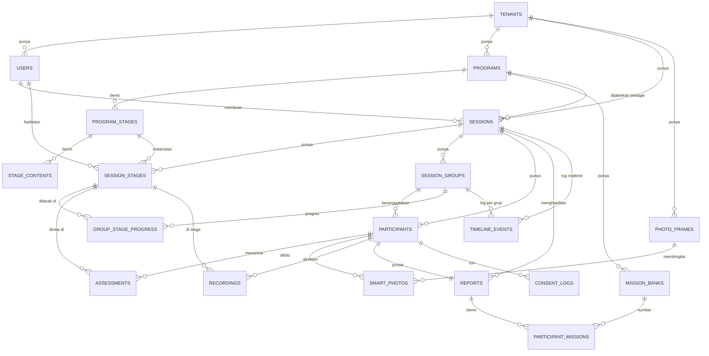

# Kidversa Backend (Go + MariaDB 12) — Implementation Plan

> **For Hermes:** Use subagent-driven-development skill to implement this plan task-by-task.

**Goal:** Bangun backend Go (Echo v5 + GORM) dengan arsitektur clean-architecture standar industri, persistence MariaDB 12, yang menggantikan seluruh lapisan IndexedDB frontend (no mock, no seed/demo, no local simulation). Frontend dialihkan dari `idb/*` ke HTTP/REST + SSE.

**Architecture:** Clean Architecture (domain ← usecase ← delivery/http, persistence sebagai adapter). Domain entities & repository interfaces dibiarkan bebas framework; Echo handler di `delivery/http`, GORM di `infrastructure/persistence`. Tenant isolation diterapkan lewat `tenant_id` di JWT + filter SQL. Realtime live dashboard via SSE (Server-Sent Events). Auth via JWT (HS256) + bcrypt, password tidak pernah plaintext.

**Tech Stack:**
- Go 1.26.4 (`backend/go.mod` sudah `go 1.26.4`)
- Echo **v5.2.1** (sudah di go.mod) — routing + middleware
- GORM **v1.31.2** (sudah di go.mod) — ORM
- **MariaDB 12** driver: `gorm.io/driver/mysql` (PENGGANTI `gorm.io/driver/sqlite` yang ada di go.mod — harus dihapus/ubah)
- `github.com/golang-jwt/jwt/v5` — signed JWT
- `golang.org/x/crypto/bcrypt` — password hash
- `github.com/joho/godotenv` — `.env` config (NO hardcoded credentials)
- `github.com/google/uuid` — UUID v4 id (menggantikan string id acak frontend)
- `github.com/golang-migrate/migrate/v4` — versioned SQL migrations (NO AutoMigrate di prod)
- SSE bawaan Echo (no extra lib) untuk live push
- File upload: simpan ke local `./uploads/` + static serve (default); siap diganti MinIO/S3 nanti

---

## 0. TEMUAN EKSPLORASI (fakta dasar — dari 5 sub-agent)

### 0.1 Status frontend hari ini (PENTING)
- **100% local-first + simulasi.** Semua service `core/services/idb/*.ts` baca/tulis IndexedDB dengan `setTimeout()` buatan.
- `backendClient.request()` **TIDAK DIPANGGIL** oleh fitur mana pun — hanya `healthCheck()`/`isBackendEnabled()`.
- `syncManager.flushSyncQueue()` hanya menandai item **FAILED** ("Backend not available").
- **`liveService.simulateProgress()`** (`core/services/idb/live.ts`) memanipulasi `group_stage_progress` + `timeline_events` PALSU → **HARUS DIHAPUS**, ganti SSE backend.
- **Parent Dashboard & StoriesPage** berisi angka/array **HARDCODE** → ganti endpoint nyata.
- Auth lokal: password **plaintext**, JWT **palsu** (`btoa`), token di `sessionStorage`.

### 0.2 Kontrak API (dari agregasi `kidversa-endpoint-map.md` — menggabungkan `core/services/types.ts` + aksi `idb/live.ts` + `participantMissionService` + kebutuhan §9)
Tiap method interface = 1 endpoint. Interface di `types.ts`: `ProgramService, SessionService, ParticipantService, UserService, FrameService, PhotoService, RecordingService, ReportService, ConsentService, AssessmentService, AuthService, MissionBankService`. Resource tambahan di luar `types.ts` (valid): `TENANTS, NOTIFICATIONS, LIVE, PARTICIPANT-MISSIONS, REPORTS-AI` (streaming) + `register`/`parent-token`/`kiosk-token` di Auth. Semua `getAll/getAll` menerima `ListParams` → `PaginatedResponse<T>` (page, limit, search, sort). Semua `id` adalah **string** (frontend pakai UUID/acak) → backend gunakan `CHAR(36)` UUIDv4.

### 0.3 Auth flow yang harus diganti
- Saat ini: `localAuthService.login` cek `BOOTSTRAP_USERS` lalu `generateToken` (btoa) → `authSession.setToken` (`kidversa_access_token` di sessionStorage).
- `backendClient.apiRequest` kirim `Authorization: Bearer <sessionStorage.getItem('auth_token')>` ke `VITE_API_BASE_URL||http://localhost:8080` (langsung ke backend, bypass proxy `/api`).
- **Diskrepansi kecil:** key sessionStorage frontend (`kidversa_access_token`) ≠ yang dibaca `apiRequest` (`auth_token`). Saat rewiring frontend, samakan ke `kidversa_access_token`.
- Parent: `ParentTokenGuard` validasi `?token=` vs `reportService`/`getParticipantById` → backend verifikasi token.
- Kiosk: `generateKioskToken(sessionId)` → backend issuer.

### 0.4 Entity → Tabel (20 entitas domain + 1 tabel auth-infra, ringkas)
User, Tenant, Program, ProgramStage, StageContent, PhotoFrame, MissionBank, Session, SessionStage, SessionGroup, GroupStageProgress, Participant, Assessment, SmartPhoto, Recording, Report, ParticipantMission, ConsentLog, TimelineEventRow, **Notification**.
Tabel auth-infra (bukan entitas domain, lihat §10.1): `refresh_tokens` (opaque refresh token + denylist jti).
> Catatan: field lengkap entitas tersedia di eksplorasi `.hermes/plans/schema-exploration.md` & `.hermes/plans/endpoint-map.md` (artefak eksplorasi, sudah dipindah ke repo). Plan ini **self-contained** untuk implementasi; dua file tersebut hanya referensi suplementer. Review SSE/resilience terkonsolidasi di §10.12–§10.14 (sumber: `.hermes/plans/sse-ressement-review.md`, `.hermes/plans/realtime-scaling-review.md`).
**Catatan `media_blobs`:** (IndexedDB) **TIDAK dibuat tabel**. File foto/rekaman disimpan ke disk (`uploads/`), URL/path absolut relatif disimpan di kolom MariaDB: `smart_photos.original_file_url`, `recordings.file_url`, `programs.thumbnail_url`, `photo_frames.file_url`. Blob tidak disimpan di DB.

### 0.5 Enum → tipe kolom MariaDB (15 enum)
`UserRole(SUPER_ADMIN,ADMIN,KOORDINATOR,FASILITATOR)`, `ContentType(VIDEO,SLIDESHOW,GAME,MIXED)`, `StageContentFileType(VIDEO,IMAGE,AUDIO,GAME_BUNDLE)`, `MissionCategory(HOME,PARENT,SCHOOL)`, `SessionStatus(DRAFT,ACTIVE,COMPLETED,CANCELLED)`, `SessionStageStatus(WAITING,ACTIVE,COMPLETED)`, `GroupStatus(WAITING,IN_PROGRESS,COMPLETED)`, `GroupStageProgressStatus(LOCKED,UNLOCKED,IN_PROGRESS,COMPLETED,SKIPPED)`, `SyncStatus(LOCAL,UPLOADING,SYNCED,FAILED)`, `RecordingsReviewStatus(PENDING,REVIEWED,SKIPPED)`, `ConsentType(RECORDING,PHOTO)`, `ReportStatus(DRAFT,PENDING_REVIEW,APPROVED,SENT)`, `ApprovalStatus(pending,approved,rejected)` ⚠ lowercase, `SyncQueueDataType` & `ConnectionStatus` (TIDAK dipakai entity → abaikan).
Gunakan `ENUM('...')` MariaDB, default NOT NULL ke state awal.

---

## 1. STRUKTUR DIREKTORI (clean architecture)

```
backend/
├─ go.mod / go.sum                 # UPDATE: hapus sqlite, tambah mysql/jwt/bcrypt/godotenv/uuid/migrate
├─ .env.example                    # template config (NO secret nyata)
├─ cmd/
│  ├─ server/main.go               # entry: load config → migrate → wire deps → echo.Start
│  └─ migrate/main.go              # CLI: up/down migration (atau subcommand server)
├─ migrations/
│  ├─ 000001_init_schema.up.sql    # semua CREATE TABLE + ENUM + INDEX
│  ├─ 000001_init_schema.down.sql  # DROP TABLE
│  └─ 000002_bootstrap.up.sql      # INSERT initial tenant + SUPER_ADMIN (idempoten) — BUKAN seed demo
├─ internal/
│  ├─ config/config.go             # EnvConfig dari godotenv (.env)
│  ├─ domain/
│  │  ├─ entity/                   # User, Tenant, Program, ... (Go structs, no GORM tag di sini? → pakai tag GORM di model)
│  │  └─ repository/               # interface: UserRepository, ProgramRepository, ... (framework-agnostic)
│  ├─ usecase/                     # bisnis logic per aggregate (UserUsecase, dsb)
│  ├─ infrastructure/
│  │  ├─ persistence/              # GORM models + repo impl (MySQL)
│  │  └─ auth/                     # JWT issuer/parser, bcrypt
│  ├─ delivery/http/
│  │  ├─ router.go                 # RouteRegistration: mount semua group
│  │  ├─ middleware/               # JWTAuth, RequireRole, TenantScope, ErrorHandler
│  │  ├─ handler/                  # AuthHandler, UserHandler, ProgramHandler, ... (1 file / resource)
│  │  └─ dto/                      # request/response structs + validation
│  └─ pkg/
│     ├─ response/                 # JSON envelope {data,error,meta}
│     ├─ errors/                   # AppError + status map
│     └─ sse/                      # SSE hub (broadcast per sessionId)
└─ uploads/                        # file foto/rekaman (gitignored)
```

**Aturan dependency (clean arch):** `delivery → usecase → domain(repository interface)`; `infrastructure/persistence` mengimplementasikan `domain/repository`. `main.go` melakukan wiring (dependency injection manual, tanpa framework DI).

---

## 2. SKEMA DB MARIADB 12 (DDL — contoh inti; sisa ikuti pola)

### 2.0 Konvensi & Prinsip Skema (mudah dibaca, mudah diskala, tanpa hardcode)

Aturan ini WAJIB diterapkan konsisten ke SEMUA tabel supaya skema rapi, jelas relasinya, dan aman diskalakan:

**A. Penamaan konsisten (readability)**
- Tabel: `snake_case`, **jamak** (`users`, `session_groups`, `group_stage_progress`).
- Kolom: `snake_case`, **tunggal**. Foreign key selalu `<entitas_tunggal>_id` (`tenant_id`, `program_id`, `session_stage_id`) — sehingga relasi langsung terbaca dari nama kolom.
- Primary key selalu bernama `id`.
- Boolean pakai prefix `is_`/`has_` (`is_active`, `is_report_photo`).
- Timestamp pakai suffix `_at` (`created_at`, `updated_at`, `deleted_at`, `sent_at`).
- Index diberi nama eksplisit: `idx_<tabel>_<kolom>` (biasa), `uq_<tabel>_<kolom>` (unique), `fk_<tabel>_<ref>` (foreign key). Nama yang konsisten bikin `SHOW INDEX` & migrasi mudah dibaca.

**B. Kolom standar di SETIAP tabel (DRY, tidak diulang manual)** — *Revisi audit: domain tetap bebas framework.*
Struktur `BaseModel` dideklarasikan di `domain/entity/base.go` sebagai **struct Go murni TANPA tag GORM dan TANPA import `gorm`** (clean-architecture: domain tidak boleh tahu ORM). Audit-field & soft-delete diterapkan oleh **GORM model terpisah** di `infrastructure/persistence` (meng-embed entity + menambah `gorm.DeletedAt` + hook `BeforeCreate` untuk generate UUID). Mapping entity↔model via fungsi `ToModel`/`ToEntity` di persistence.

```go
// internal/domain/entity/base.go  (PURE Go, no gorm import)
type BaseModel struct {
    ID        string    `json:"id"`
    CreatedAt time.Time `json:"created_at"`
    UpdatedAt time.Time `json:"updated_at"`
}

// internal/infrastructure/persistence/models/report_model.go (contoh)
type ReportModel struct {
    entity.Report               // embed domain entity (tanpa soft-delete)
    DeletedAt     gorm.DeletedAt `gorm:"type:datetime(3);index" json:"-"`
    ParentAccessToken string     `gorm:"type:char(64);uniqueIndex" json:"-"` // §9: json:"-" cegah leak
    ParentTokenExpiresAt time.Time `gorm:"type:datetime(3)" json:"-"`
    ParentTokenRevoked   bool       `gorm:"not null default 0" json:"-"`
}
func (m *ReportModel) BeforeCreate(tx *gorm.DB) error {
    if m.ID == "" { m.ID = uuid.NewString() }
    return nil
}
```
**Keputusan tunggal (resolve F1-arch / F2 / F7 / F27 / F19):** SATU sumber kebenaran = domain entity murni (`ID string`, cocok `CHAR(36)` + `uuid.NewString()`); GORM model terpisah di persistence. **JANGAN** tulis `ID uuid.UUID` (T1.1 revisi → `ID string`). Tidak ada duplikasi god-object karena mapper per-model kecil & eksplisit.

**C. Tanpa hardcode (scalability & maintainability)**
- **Enum di satu sumber:** definisi enum ada di Go (`internal/domain/entity/enums.go`) + tipe kolom `ENUM(...)` di migration. JANGAN tebar string literal `"ACTIVE"` di seluruh kode — pakai konstanta `entity.SessionStatusActive`. Frontend enum (`enums.ts`) = sumber kebenaran, backend mirror 1:1.
- **Tenant isolation bukan hardcode:** `tenant_id` di-inject dari JWT via middleware + GORM scope reusable `scopes.ByTenant(tenantID)` — bukan `WHERE tenant_id='xxx'` yang ditulis manual di tiap query.
- **Konfigurasi (ukuran kolom, page size, batas upload) dari config/const terpusat**, bukan magic number di query.
- **Migration versioned** (golang-migrate) — perubahan skala/skema lewat file migration berurutan, bukan `ALTER` manual ad-hoc. Setiap perubahan tabel = migration baru, reversible (`.up`/`.down`).

**D. Strategi skalabilitas (siap tumbuh)**
- **Index pada semua FK & kolom filter** (status, tenant_id, session_date, sync_status) → query list/filter tetap cepat saat data besar.
- **Composite index** untuk pola query gabungan (`idx_participants_session_group (session_id, group_id)`, `uq_group_stage (group_id, session_stage_id)`).
- **Pagination wajib** (`ListParams` → LIMIT/OFFSET, atau keyset pagination untuk tabel besar seperti `timeline_events`/`assessments`).
- **Tabel high-volume** (`timeline_events`, `recordings`, `smart_photos`, `assessments`) siap di-partisi by `created_at`/`session_id` bila perlu — desain PK/index sudah mendukung.
- **Charset `utf8mb4` + collation `utf8mb4_unicode_ci`** di semua tabel (dukungan emoji/nama internasional, konsisten).
- **`ON DELETE` eksplisit** di FK: `RESTRICT` untuk relasi kritis (jangan hapus program yang punya session), `CASCADE` untuk anak yang tak berarti tanpa induk (`stage_contents` ikut terhapus bila `program_stage` dihapus). Dokumentasikan tiap FK.

### 2.1 ERD — Relasi Antar Entitas (mudah dibaca)



**Hierarki FK ringkas (top-down):** `tenants` → `users`/`programs`/`sessions`/`photo_frames`; `programs` → `program_stages` → `stage_contents`; `sessions` → `session_stages`/`session_groups`/`participants`; `session_groups`+`session_stages` → `group_stage_progress`; `participants` → `assessments`/`smart_photos`/`recordings`/`reports`/`consent_logs`; `reports` → `participant_missions`.

Catatan: `id CHAR(36)` UUIDv4 PK (via `BaseModel.BeforeCreate`, tidak hardcode). Semua timestamp `DATETIME(3)` (butuh presisi ms untuk timeline). JSON pakai `JSON` MariaDB 12 native. Soft-delete: kolom `deleted_at DATETIME(3) NULL` + GORM `gorm.DeletedAt` (standar industri, no hard delete kecuali eksplisit).

```sql
-- 000001_init_schema.up.sql (ringkas; lengkapi tiap tabel dari §0.4)
-- SEMUA tabel domain: charset utf8mb4 + kolom BaseModel (id, created_at, updated_at, deleted_at) + index deleted_at.
-- Contoh berikut HARUS dicopy-kanonik ke 16 tabel lainnya (audit: DDL contoh lama langgar BaseModel → HIGH).

CREATE TABLE tenants (
  id CHAR(36) NOT NULL,
  name VARCHAR(120) NOT NULL,
  slug VARCHAR(120) NOT NULL,
  settings_json JSON NULL,
  created_at DATETIME(3) NOT NULL DEFAULT NOW(3),
  updated_at DATETIME(3) NOT NULL DEFAULT NOW(3),
  deleted_at DATETIME(3) NULL,
  PRIMARY KEY (id),
  UNIQUE KEY uq_tenants_slug (slug),
  KEY idx_tenants_deleted_at (deleted_at)
) DEFAULT CHARSET=utf8mb4 COLLATE=utf8mb4_unicode_ci;

CREATE TABLE users (
  id CHAR(36) NOT NULL,
  tenant_id CHAR(36) NULL,
  email VARCHAR(255) NOT NULL,
  password_hash VARCHAR(255) NOT NULL,
  role ENUM('SUPER_ADMIN','ADMIN','KOORDINATOR','FASILITATOR') NOT NULL,
  name VARCHAR(120) NOT NULL,
  phone VARCHAR(40) NULL,
  avatar_url VARCHAR(512) NULL,
  is_active BOOLEAN NOT NULL DEFAULT 0,
  approval_status ENUM('pending','approved','rejected') NOT NULL DEFAULT 'pending',
  approved_at DATETIME(3) NULL, approved_by CHAR(36) NULL,
  rejected_at DATETIME(3) NULL, rejected_by CHAR(36) NULL, rejection_reason VARCHAR(255) NULL,
  created_at DATETIME(3) NOT NULL DEFAULT NOW(3),
  updated_at DATETIME(3) NOT NULL DEFAULT NOW(3),
  deleted_at DATETIME(3) NULL,
  PRIMARY KEY (id),
  UNIQUE KEY uq_users_email (email),
  KEY idx_users_tenant (tenant_id),
  KEY idx_users_role (role),
  KEY idx_users_approval_status (approval_status),
  KEY idx_users_is_active (is_active),
  KEY idx_users_deleted_at (deleted_at),
  CONSTRAINT fk_users_tenant FOREIGN KEY (tenant_id) REFERENCES tenants(id) ON DELETE RESTRICT,
  CONSTRAINT fk_users_approved_by FOREIGN KEY (approved_by) REFERENCES users(id) ON DELETE SET NULL,
  CONSTRAINT fk_users_rejected_by FOREIGN KEY (rejected_by) REFERENCES users(id) ON DELETE SET NULL
) DEFAULT CHARSET=utf8mb4 COLLATE=utf8mb4_unicode_ci;

CREATE TABLE programs (
  id CHAR(36) NOT NULL, tenant_id CHAR(36) NOT NULL,
  name VARCHAR(160) NOT NULL, description TEXT NULL, thumbnail_url VARCHAR(512) NULL,
  is_active BOOLEAN NOT NULL DEFAULT 1,
  created_at DATETIME(3) NOT NULL DEFAULT NOW(3),
  updated_at DATETIME(3) NOT NULL DEFAULT NOW(3),
  deleted_at DATETIME(3) NULL,
  PRIMARY KEY (id),
  KEY idx_programs_tenant (tenant_id),
  KEY idx_programs_deleted_at (deleted_at),
  CONSTRAINT fk_programs_tenant FOREIGN KEY (tenant_id) REFERENCES tenants(id) ON DELETE RESTRICT
) DEFAULT CHARSET=utf8mb4 COLLATE=utf8mb4_unicode_ci;

-- program_stages, stage_contents, photo_frames, mission_banks, sessions,
-- session_stages, session_groups, group_stage_progress, participants,
-- assessments, smart_photos, recordings, reports, participant_missions,
-- consent_logs, timeline_events  → ikuti field §0.4 + enum §0.5 + FK & INDEX + BaseModel.
-- Aturan wajib tiap tabel (audit §2/§3):
--   * SETIAP tabel domain punya (id, created_at, updated_at, deleted_at) + idx deleted_at.
--   * FK eksplisit + ON DELETE: RESTRICT untuk induk kritis (tenant/program/session/report/participant),
--     CASCADE untuk anak tak berarti tanpa induk (stage_contents, group_stage_progress, assessments,
--     smart_photos, recordings, participant_missions, consent_logs, timeline_events),
--     SET NULL untuk kolom audit *_by (approved_by, rejected_by, unlocked_by, reviewed_by, assessed_by, created_by, fasilitator_id).
--   * Denormalisasi session_id + index pada assessments(recorded via session_stage), recordings, consent_logs
--     (audit: endpoint ?session_id= butuh kolom ini → HIGH). Contoh:
--       assessments: tambah session_id CHAR(36) NOT NULL + KEY idx_assessments_session (session_id);
--                    FK fk_assessments_session → sessions(id) ON DELETE CASCADE.
--       recordings:  tambah session_id CHAR(36) NOT NULL + KEY idx_recordings_session (session_id);
--                    fk_recordings_session → sessions(id) ON DELETE CASCADE.
--       consent_logs: tambah session_id CHAR(36) NOT NULL + KEY idx_consent_logs_session (session_id);
--                    fk_consent_logs_session → sessions(id) ON DELETE CASCADE.
--   * timeline_events: composite index (session_id, created_at) + (group_id, created_at) untuk keyset pagination.
--   * sessions: idx (tenant_id, status, session_date) — list/filter utama.
--   * mission_banks: idx (program_id, category); photo_frames: idx (tenant_id, program_id).
--   * smart_photos: idx is_report_photo; recordings: idx review_status.
--   * Partisi (audit HIGH): PK saat ini CHAR(36) bentrok dgn RANGE PARTITION BY created_at. KEPUTUSAN:
--     tabel high-volume (timeline_events, recordings, smart_photos, assessments) TIDAK dipartisi di v1;
--     bila kelak butuh partisi, ubah PK jadi (id, created_at) atau PARTITION BY KEY(id). Dokumentasikan, jangan lakukan sekarang.
--   * reports: parent_access_token CHAR(64) NULL UNIQUE (§9), parent_token_expires_at DATETIME(3) NULL,
--     parent_token_revoked BOOLEAN NOT NULL DEFAULT 0; FK reports.participant_id→participants ON DELETE RESTRICT,
--     reports.session_id→sessions ON DELETE RESTRICT.
--     CEK duplikat rapor: JANGAN pakai UNIQUE biasa (bentrok soft-delete) — pakai generated column (lihat §2.2 / §10.11).
--   * current_stage_id di session_groups → rename ke current_session_stage_id (konvensi <entitas>_id).

### 2.2 Tabel auth-infra & notifikasi (tambahan audit iterasi-1)
Tabel berikut **wajib ada** di migrasi `000001_init_schema.up.sql` (audit: direferensikan di §10.1/§10.7 tapi terlewat di DDL inti):

```sql
-- Opaque refresh token (anti stateless-replay); hash token, jangan simpan plaintext.
CREATE TABLE refresh_tokens (
  id CHAR(36) NOT NULL, user_id CHAR(36) NOT NULL,
  token_hash VARCHAR(255) NOT NULL,        -- SHA-256 hex dari refresh token opaque
  expires_at DATETIME(3) NOT NULL,
  revoked_at DATETIME(3) NULL,              -- di-set saat logout / password change
  created_at DATETIME(3) NOT NULL DEFAULT NOW(3),
  updated_at DATETIME(3) NOT NULL DEFAULT NOW(3),
  deleted_at DATETIME(3) NULL,
  PRIMARY KEY (id),
  KEY idx_refresh_user (user_id),
  KEY idx_refresh_deleted_at (deleted_at),
  CONSTRAINT fk_refresh_user FOREIGN KEY (user_id) REFERENCES users(id) ON DELETE CASCADE
) DEFAULT CHARSET=utf8mb4 COLLATE=utf8mb4_unicode_ci;

-- Notifikasi persisten (§10.7): SSE push + simpan agar offline user tak kehilangan notif.
CREATE TABLE notifications (
  id CHAR(36) NOT NULL, tenant_id CHAR(36) NOT NULL,
  recipient_user_id CHAR(36) NOT NULL, type VARCHAR(40) NOT NULL,
  ref_id VARCHAR(64) NULL, message VARCHAR(512) NULL, is_read BOOLEAN NOT NULL DEFAULT 0,
  created_at DATETIME(3) NOT NULL DEFAULT NOW(3),
  updated_at DATETIME(3) NOT NULL DEFAULT NOW(3),
  deleted_at DATETIME(3) NULL,
  PRIMARY KEY (id),
  KEY idx_notif_tenant (tenant_id),
  KEY idx_notif_recipient (recipient_user_id, is_read),
  KEY idx_notif_created (created_at),
  KEY idx_notif_deleted_at (deleted_at),
  CONSTRAINT fk_notif_tenant FOREIGN KEY (tenant_id) REFERENCES tenants(id) ON DELETE CASCADE,
  CONSTRAINT fk_notif_recipient FOREIGN KEY (recipient_user_id) REFERENCES users(id) ON DELETE CASCADE
) DEFAULT CHARSET=utf8mb4 COLLATE=utf8mb4_unicode_ci;
```
**Perbaikan soft-delete + unique (audit iterasi-1, DIPERBAIKI iterasi-2):** Menambah `deleted_at` ke unique index **TIDAK** menyelesaikan masalah. Di MariaDB/MySQL, nilai NULL di unique index dianggap *distinct*, sehingga dua baris aktif (`deleted_at IS NULL`) dengan pasangan `(participant_id, session_id)` sama **tetap diizinkan** → bug duplikat rapor BELUM terselesaikan (hanya tersembunyi). Gunakan pola *generated column* agar tepat SATU baris aktif per pasangan, tanpa batas soft-delete:
```sql
ALTER TABLE reports
  ADD COLUMN active_uniq TINYINT AS (CASE WHEN deleted_at IS NULL THEN 1 ELSE NULL END) VIRTUAL,
  ADD UNIQUE KEY uq_reports_participant_session (participant_id, session_id, active_uniq);
```
`active_uniq = 1` hanya untuk baris aktif (satu-satunya, karena NULL diabaikan unique) → duplikat aktif terblokir; baris soft-deleted bernilai NULL (diabaikan) → histori tak terbatas. Terapkan pola sama untuk unique ber-soft-delete lain yang kritis (`uq_tenants_slug` → `(slug, active_uniq)`; atau cukup hard-restrict tenant + slug unik global tanpa soft-delete slug).
**Default ENUM awal (audit iterasi-1):** pastikan tiap tabel punya default state awal NOT NULL: `sessions.status` DEFAULT 'DRAFT', `session_stages.status` DEFAULT 'WAITING', `session_groups.status` DEFAULT 'WAITING', `group_stage_progress.status` DEFAULT 'LOCKED', `recordings.review_status` DEFAULT 'PENDING', `reports.status` DEFAULT 'DRAFT', `consent_logs` (ConsentType wajib diisi, no default). Jangan biarkan ENUM tanpa default (rawan error insert).

**Bootstrap (bukan seed demo)** `000002_bootstrap.up.sql` **TIDAK** berisi password (bcrypt tak bisa di SQL). Bootstrap dilakukan di **Go** (`cmd/migrate` setelah `up`): idempoten via `INSERT IGNORE`/`FirstOrCreate` berbasis unique (tenant slug, user email) — UUID bootstrap tetap. Superadmin password **TIDAK di-hardcode di repo**: ambil dari env `BOOTSTRAP_SUPERADMIN_PASSWORD` (fallback: generate acak + **cetak ke console sekali** + set flag `must_change_password=1` wajib ganti di first-login). Tenant `tenant-bandung` + `tenant-subang`, user `superadmin@kidversa.id` (SUPER_ADMIN global) + `admin.bandung@kidversa.id` (ADMIN, tenant-bandung). Nilai disamakan `core/services/local/bootstrap.ts`. (Revisi audit F1 CRITICAL: jangan commit plaintext `password123`.)

---

## 3. PETA ENDPOINT REST (dari `types.ts`, 1:1 — lengkap dari `.hermes/plans/endpoint-map.md`)

**AUTH** `/api/auth`: `POST /login`, `POST /register`, `POST /refresh`, `GET /me`, `POST /logout`, `POST /change-password`, `POST /kiosk-token`, `POST /parent-token`. (§10.1: `/change-password` wajib revoke semua refresh token user + denylist jti aktif.)
**TENANTS** `/api/tenants` (SUPER_ADMIN): GET/POST, `/:id` GET/PUT/DELETE.
**USERS** `/api/users`: GET list `?page&limit&search&role&approval_status&is_active&tenant_id`, POST, `/:id` GET/PUT, `/:id/approve`, `/:id/reject`, `/:id/deactivate`, `/:id` DELETE.
**PROGRAMS** `/api/programs`: GET/POST, `/:id` GET/PUT, `/:id/toggle-active`, DELETE; `/:id/stages` GET/POST, `/:id/stages/:stageId` PUT/DELETE, `/:id/stages/reorder` POST; `/program-stages/:stageId/contents` GET, `.../contents` POST/PUT/DELETE, `/reorder` POST.
**SESSIONS** `/api/sessions`: GET/POST, `/:id` GET/PUT, `/:id/start|complete|cancel`, DELETE; `/:id/stages` GET, `/:id/stages/:stageId/assign` POST; `/:id/groups` GET/POST, `/:id/groups/:groupId` PUT/DELETE; `/:id/participants` GET/POST, `/import` POST, `/link` POST, `/:participantId` PUT/DELETE.
**LIVE** `/api/live`: `GET /:sessionId/groups`, `GET /:sessionId/timeline`, `POST /groups/:groupId/stages/:stageId/unlock|complete|skip`, `POST /groups/:groupId/jump`, `POST /groups/:groupId/reset`, `POST /events`. **SSE:** `GET /:sessionId/stream` (push progress+timeline). **TIDAK ADA** `simulateProgress`.
**NOTIFICATIONS** `/api/notifications`: `GET /stream` (SSE push ke role terkait). **REPORTS AI:** `POST /api/reports/generate` (mulai job) + `GET /api/reports/:id/narrative-stream` (SSE streaming narasi). Lihat §8.
**ASSESSMENTS** `/api/assessments`: `POST /upsert`, `POST /bulk-upsert`, `GET ?participant_id=|?session_id=`.
**PHOTOS** `/api/photos`: GET `?session_id=|?participant_id=`, `POST /upload` (multipart), `PATCH /:id`, `DELETE /:id`.
**RECORDINGS** `/api/recordings`: GET `?...`, `POST /upload` (multipart), `PATCH /:id`, `DELETE /:id`.
**REPORTS** `/api/reports`: `GET /access?token=<64hex>` (**PUBLIC**, verifikasi token §9), `GET ?session_id=|/:id`, `POST /generate`, `/:id/approve`, `/:id/send` (generate+kirim token), `/:id/revoke-token`, `GET /:id/narrative-stream` (SSE §8.4).
**MISSION-BANKS** `/api/mission-banks`: GET/POST/PUT/DELETE, `/:id/toggle-active`.
**PARTICIPANT-MISSIONS** `/api/participant-missions`: GET `?report_id=|?participant_id=`, `/:id/toggle`, `/assign` POST, `/replace` PUT.
**CONSENT** `/api/consent`: `POST /request`, `GET ?session_id=`, `POST /submit`.
**FRAMES** `/api/frames`: GET/POST/PUT, `/:id/deactivate`.
**HEALTH** `GET /health` (sudah dipanggil `healthCheck`).

Semua response dibungkus `pkg/response`: `{ data, meta?:{page,limit,total}, error?:{code,message} }`.

---

## 4. ALOUR MIGRASI FRONTEND → BACKEND (yang diubah di `frontend/`)

1. **`core/services/types.ts` tetap** sebagai kontrak; ganti tiap `idb/<domain>.ts` menjadi HTTP impl yang memanggil `backendClient.request()` (sudah ada). Set `kidversa_backend_enabled=true` via env/build flag (bukan localStorage manual).
2. **Auth:** ganti `core/services/local/auth.ts` → panggil `/api/auth/*`. Simpan `kidversa_access_token` (samakan key dgn `apiRequest`). Password via HTTPS, bcrypt di backend.
3. **Hapus** `LiveMonitorPage` tombol "Mulai Simulasi" + `liveService.simulateProgress`. Ganti polling 5s dgn **EventSource** ke `GET /api/live/:sessionId/stream` (SSE). Override (complete/unlock/skip) → POST ke `/api/live/*`.
4. **Parent Dashboard & StoriesPage:** ganti hardcoded JSX dengan fetch `/api/...` nyata (progress bacaan, daftar cerita + progress).
5. **File upload:** `photoService.upload`/`recordingService.upload` kirim `FormData` multipart ke `/api/photos/upload` & `/api/recordings/upload`; simpan `file_url` dari response (bukan `URL.createObjectURL`).
6. **`syncManager`** benar-benar flush ke backend (bukan mark FAILED) — atau hapus sync queue karena sudah online-real-time.
7. **Tenant switching:** SUPER_ADMIN kirim `X-Tenant-Id` header; backend pakai itu sebagai scope (ganti `kidversa_active_tenant_id` localStorage).
8. **Parent token:** `ParentTokenGuard` validasi `?token=` via `GET /api/reports?...` / endpoint verifikasi token, bukan lokal.

---

## 5. TAHAP IMPLEMENTASI (bite-sized, TDD per fitur)

Setiap task: tulis test (handler/usecase) → run FAIL → implement → run PASS → commit. Berikut pengelompokan; berikan kode lengkap untuk **Task A (Auth login)** sebagai template, sisanya mengikuti pola sama (satu handler per resource).

### Phase 0 — Scaffolding
- **T0.1** Update `backend/go.mod` → ganti driver `sqlite` ke `mysql`, tambah deps di bawah. **SEMUA versi sudah diverifikasi ke sumber resmi** (pkg.go.dev + GitHub releases) per 2026-07-12:
  | Library | Versi (terverifikasi resmi) | Sumber |
  |---|---|---|
  | `github.com/labstack/echo/v5` | v5.2.1 (sudah ada, ada security fix GHSA-vfp3-v2gw-7wfq) | github.com/labstack/echo/releases |
  | `gorm.io/gorm` | v1.31.2 (sudah ada) | github.com/go-gorm/gorm/releases |
  | `gorm.io/driver/mysql` | v1.6.0 (sudah ada) | deps.dev / pkg.go.dev |
  | `github.com/golang-jwt/jwt/v5` | v5.3.1 | github.com/golang-jwt/jwt/releases |
  | `golang.org/x/crypto` | pseudo-version stable terbaru | pkg.go.dev/golang.org/x/crypto |
  | `github.com/google/uuid` | v1.6.0 | github.com/google/uuid/releases |
  | `github.com/joho/godotenv` | **v1.5.1** (v1.6.0 masih pre-release ⚠ jangan pakai) | github.com/joho/godotenv/releases |
  | `github.com/golang-migrate/migrate/v4` | v4.19.1 | github.com/golang-migrate/migrate/releases |
  **Cara install (biarkan go tool resolve pseudo-version & checksum):**
  ```bash
  cd backend
  # hapus driver sqlite (tidak dipakai)
  go mod edit -droprequire gorm.io/driver/sqlite
  go get gorm.io/driver/mysql@v1.6.0
  go get github.com/golang-jwt/jwt/v5@v5.3.1
  go get golang.org/x/crypto         # ambil stable pseudo-version terbaru
  go get github.com/google/uuid@v1.6.0
  go get github.com/joho/godotenv@v1.5.1
  go get github.com/golang-migrate/migrate/v4@v4.19.1
  go mod tidy
  ```
  **Verifikasi sebelum install (wajib, sesuai instruksi):** cek ke sumber resmi bahwa versi di atas masih yang terbaru & tidak ditarik (mis. `go list -m -versions <mod>` atau cek GitHub releases/pkg.go.dev). Jika ada rilis baru yang kompatibel Go 1.26.4, pakai yang baru. Commit `go.mod` + `go.sum`.
- **T0.2** Buat `.env.example` (dev — connect ke container `mariadb-12` yang sudah running). **JANGAN commit `.env`**:
  ```
  DB_HOST=127.0.0.1
  DB_PORT=3306
  DB_USER=root
  DB_PASSWORD=admin
  DB_NAME=kidversa
  JWT_SECRET=<generate-32-byte-random>   # WAJIB >=32 byte; server log.Fatal bila kosong (§10.1)
  JWT_ACCESS_TTL=15m
  JWT_REFRESH_TTL=168h
  BCRYPT_COST=12
  REPORT_TOKEN_TTL_HOURS=168
  CORS_ORIGINS=http://localhost:5173
  SERVER_PORT=8080
  UPLOAD_DIR=./uploads
  BOOTSTRAP_SUPERADMIN_PASSWORD=<random-atau-kosong-generate>
  ```
  Catatan: nilai dev (container `mariadb-12`, root/`admin`). Untuk prod: user dedicat + password kuat via secret manager. `.env` **hanya untuk `go run` native**; compose override `DB_HOST` (lihat T0.6, §10.9).
- **T0.3** `internal/config/config.go`: baca godotenv → struct `Config`. Test: load dari env.
- **T0.5** `Dockerfile` (multi-stage: `golang:1.26` build → `debian:stable-slim` runtime; expose 8080; `CMD ["/app/server"]`). `.dockerignore` (uploads, .env).
- **T0.6** `docker-compose.yml`: **hanya service `backend`** (DB `mariadb-12` sudah running terpisah di host). Backend connect via `host.docker.internal` (linux: `172.17.0.1` + `extra_hosts`). **PENTING:** compose pakai `environment:` override `DB_HOST=host.docker.internal` (JANGAN `env_file: .env` yg akan override ke `127.0.0.1`, lihat §10.9). Compose: `build`, `environment: DB_HOST=host.docker.internal, DB_PORT=3306, DB_USER=root, DB_PASSWORD=admin, DB_NAME=kidversa, JWT_SECRET=..., CORS_ORIGINS=http://localhost:5173`, `ports: 8080:8080`, `volumes: ./uploads:/app/uploads`, `extra_hosts: host.docker.internal:host-gateway`, `restart: unless-stopped`. Tidak spawn MariaDB baru. Commit.
- **T0.7** `middleware/error.go`: `e.HTTPErrorHandler` normalisasi semua error/panic → envelope `{error:{code,message}}` (§10.5). Ter-register paling luar + `Recover`.
- **T0.8** `middleware/cors.go`: allowlist `CORS_ORIGINS` + security headers (§10.5).
- **T0.9** `middleware/ratelimit.go`: token-bucket per-IP 60 req/menit di `/auth/login`, `/auth/refresh`, `/auth/register` (brute/abuse) & `/reports/access` (DoS token-guessing, §9.2). Konfigurable via config `RATE_LIMIT_PER_MIN`.
- **T0.10** Setup `echo.Validator` (go-playground/validator/v10) — dibutuhkan `c.Validate` di handler (§10.5).
- **T0.11** `GET /health` handler (sudah dipanggil `healthCheck`).

### Phase 1 — Domain + Persistence + Migrations
- **T1.1** `internal/domain/entity/*.go`: struct Go murni untuk 19 entitas (field dari §0.4, **`ID string`** — cocok `CHAR(36)` + `uuid.NewString()`, BUKAN `uuid.UUID`, lihat §10.9). Audit-field via `BaseModel` (§2.0B, pure Go).
- **T1.2** `internal/domain/repository/*.go`: interface per aggregate (e.g. `UserRepository: Create/GetByID/GetByEmail/List/Update/Delete`).
- **T1.3** `migrations/000001_init_schema.up.sql` + `.down.sql` (semua tabel + enum + FK + index dari §2).
- **T1.4** `internal/infrastructure/persistence/*.go`: GORM model + repo impl (MySQL). Test: repo integration test butuh MariaDB (jalankan via `docker run mariadb:12` di CI/lokal).
- **T1.5** `migrations/000002_bootstrap.up.sql` + migrate CLI idempoten (tenant + SUPER_ADMIN bcrypt).
- **T1.6** `cmd/migrate`: alur connect root (tanpa DB) → `CREATE DATABASE IF NOT EXISTS kidversa CHARACTER SET utf8mb4 COLLATE utf8mb4_unicode_ci;` (DB_NAME dari config) → **reconnect dengan DSN ber-DB** → jalankan migration (golang-migrate butuh nama DB untuk tabel `schema_migrations`). Ini karena container `mariadb-12` tidak punya `MARIADB_DATABASE` auto-create.

### Phase 2 — Auth (TEMPLATE LENGKAP)
- **T2.1** `internal/infrastructure/auth/jwt.go`: `Generate(userID, tenantID, role) (access, refresh string)`, `Parse(token) (Claims, error)`. Test unit (sign+parse roundtrip).
- **T2.2** `internal/infrastructure/auth/bcrypt.go`: `Hash/Compare`. Test.
- **T2.3** `internal/usecase/auth_usecase.go`: `Login(email,password)` → verifikasi bcrypt + cek `is_active`/`approval_status` → issue JWT. Test (pakai repo fake).
- **T2.4** `internal/delivery/http/handler/auth_handler.go`:
```go
func (h *AuthHandler) Login(c echo.Context) error {
  var req dto.LoginRequest
  if err := c.Bind(&req); err != nil { return response.Fail(c, 400, "invalid_body") }
  if err := c.Validate(&req); err != nil { return response.Fail(c, 400, err.Error()) }
  out, err := h.authUC.Login(req.Email, req.Password)
  if err != nil { return response.Fail(c, 401, "invalid_credentials") }
  return response.OK(c, out) // {access_token, refresh_token, user}
}
```
- **T2.5** `middleware/jwt.go`: ekstrak `Authorization: Bearer`, parse → set `c.Set("user", claims)`. Test handler pakai httptest + token valid/invalid.
- **T2.6** Endpoint `/api/auth/register`, `/refresh`, `/me`, `/logout`, `/kiosk-token`, `/parent-token`. Commit tiap endpoint.

### Phase 3 — Tenant + Users + Role middleware
- **T3.1** `middleware/role.go`: `RequireRole(...roles)` dari claims.
- **T3.2** `middleware/tenant.go`: SUPER_ADMIN baca `X-Tenant-Id`; lainnya pakai `claims.TenantID`; set `c.Set("tenant_id")`. Semua repo query append `WHERE tenant_id = ?`.
- **T3.3** UserHandler: list (paginated + filter), create, get/update, approve/reject/deactivate, delete. Ikuti pola T2.4.

### Phase 4–8 — Resource handlers (pola sama per resource)
Setiap resource: entity → repo → usecase → handler + route + test. Urutan:
- **Phase 4:** Programs + Stages + Contents
- **Phase 5:** Sessions + Stages + Groups + Participants (termasuk `start/complete/cancel`, `import`, `link`)
- **Phase 6:** Live + GroupStageProgress + Timeline + **SSE hub** (`pkg/sse` §8.1) + route `GET /api/live/:sessionId/stream` (§8.2) + **Notifications SSE** `GET /api/notifications/stream` (§8.3). Setiap mutasi progress/timeline → `hub.Publish`. Hapus konsep simulate.
- **Phase 7:** Assessments, Photos, Recordings, Reports (**generate** async + SSE `narrative-stream` §8.4, approve/send), MissionBanks, ParticipantMissions, Consent, Frames.
- **Phase 8:** File upload handler (multipart → simpan `uploads/` → kembalikan `media_id`/`file_url` internal). **Akses media lewat route terautentikasi** `GET /api/media/:kind/:id` (cek JWT + tenant scope + consent), BUKAN `e.Static` publik. Disk tetap `cfg.UploadDir` (gitignored); abstraksi `FileStore` (§7) siap swap ke MinIO/S3.

### Phase 9 — Frontend rewiring (lihat §4)
Lakukan per fitur, jalankan `pnpm build` tiap tahap. Hapus `simulateProgress` + tombol simulasi + hardcoded parent dashboard/stories.

### Phase 10 — Verification
- **T10.1** MariaDB 12 sudah running (`docker ps` → `mariadb-12`, port `3306`, root/`admin`). Tidak perlu spawn DB baru.
- **T10.2** `go run ./cmd/migrate up` (migrate CLI akan `CREATE DATABASE IF NOT EXISTS kidversa` lalu jalankan migration). Cek: `docker exec mariadb-12 mariadb -uroot -padmin kidversa -e "SHOW TABLES;"`.
- **T10.3** `go test ./...` (unit + integration dengan DB test ke `127.0.0.1:3306`).
- **T10.4** `go run ./cmd/server` → `curl /health` 200; `curl /api/auth/login` → token.
- **T10.5** Cek SSE: `curl -N -H "Authorization: Bearer <token>" http://localhost:8080/api/live/<sessionId>/stream` → menerima event push saat override stage.
- **T10.6** Frontend: `pnpm build` harus PASS (strict TS, no unused). Jalankan dev, login via backend, cek live dashboard lewat SSE (bukan simulasi), notifikasi realtime, AI narrative streaming.

---

## 8. ARSITEKTUR REALTIME (pengganti SELURUH simulasi frontend)

Semua fitur yang tadinya **disimulasikan** di frontend (`simulateProgress`, polling 5s, activity feed lokal, AI narasi placeholder) diganti dengan push **server→client** nyata. Pendekatan: **SSE (Server-Sent Events)** sebagai primadona (satu arah, auto-reconnect, native `EventSource` di browser, mudah lewat proxy), dengan **WebSocket (gorilla/websocket)** hanya bila interaktivitas dua arah ketat diperlukan (tidak dipakai di v1).

### 8.1 SSE Hub (`internal/pkg/sse/hub.go`)
Singleton thread-safe: `map[channel]map[clientID]chan Event`. API:
- `hub.Subscribe(channel string) (clientID string, ch <-chan Event, unsub func())`
- `hub.Publish(channel string, event Event)` — broadcast ke semua subscriber channel.
- Channel konvensi: `live:<sessionId>` (progress+timeline), `notif:<role|userId>`, `report:<reportId>:narrative`.
Event = `{ id, type, data JSON, ts }`. Handler SSE: set header `Content-Type: text/event-stream`, `Cache-Control: no-cache`, `Connection: keep-alive`, `X-Accel-Buffering: no`; stream `hub.Subscribe` via `c.Stream`/goroutine + `c.Response().Flush()`.

### 8.2 Live progress (ganti `simulateProgress` + polling 5s)
- Fasilitator/Admin override (complete/unlock/skip/jump/reset) → usecase mutasi DB → `hub.Publish("live:<sessionId>", {type:"progress"|"timeline", data})`.
- `GET /api/live/:sessionId/stream` (SSE, auth JWT) → client `EventSource` menerima push; **tidak ada tombol "Mulai Simulasi"**, tidak ada `setInterval` 5s.
- `LiveMonitorPage` & fasilitator dashboard: hapus logic simulasi, subscribe SSE saja.
- **Authz mutasi live (MEDIUM, §10.1):** endpoint `POST /groups/:groupId/stages/:stageId/unlock|complete|skip`, `POST /groups/:groupId/jump|reset`, `POST /events` **wajib** `RequireRole(FASILITATOR,ADMIN,SUPER_ADMIN)` DAN scope tenant = session terkait (session→tenant). `GET /api/live/:sessionId/stream` (SSE) butuh JWT valid + user milik tenant session yang sama (atau SUPER_ADMIN). Tolak 403 bila beda tenant.

### 8.3 Notifikasi realtime (ganti activity feed lokal di Dashboard admin)
- `GET /api/notifications/stream` (SSE, auth JWT) → channel `notif:<role>` atau `notif:<userId>`.
- Trigger: user approve/reject, session start/complete, report generate/approve/send, consent submit, photo/rekaman di-upload. Usecase terkait panggil `hub.Publish("notif:<role>", {type, message, ref})`.

### 8.4 AI narrative streaming (ganti placeholder statis, siap LLM)
- `POST /api/reports/generate` → buat Report DRAFT, jalankan `GenerateNarrative` usecase **async** (goroutine): placeholder saat ini menulis narasi per-bagian; saat LLM nyata tersedia, stream token.
- `GET /api/reports/:id/narrative-stream` (SSE) → channel `report:<id>:narrative`, push chunk narasi (`{type:"narrative_chunk", text}` lalu `{type:"narrative_done"}`). Frontend menampilkan streaming (typewriter), bukan tunggu selesai.
- `GenerateNarrative` interface: `Generate(ctx, reportID) error` + callback `OnChunk(text)`. Placeholder impl: emit 3-4 chunk statis; abstraksi `NarrativeGenerator` agar mudah swap ke LLM (OpenAI/llama) nanti tanpa ubah handler.

### 8.5 Tradeoff SSE vs WS
SSE dipilih: native di browser (`EventSource`, auto-reconnect, tanpa lib JS), satu arah cukup untuk push. Jika suatu fitur butuh client→server lewat koneksi yang sama (belum ada saat ini), naikkan ke WebSocket. Keduanya behind Echo; abstraction `RealtimeChannel` biar swap mudah.

---

## 9. KEAMANAN TOKENISASI RAPOR ORANG TUA (anti-IDOR / token guessing)

**Masalah yang dicegah:** user/hacker menebak token berurutan (mis. `/reports/access?token=1042`) lalu membuka rapor anak/orang tua lain. Ini *Insecure Direct Object Reference* via enumerable token. Solusi: **token acak kriptografis ber-entropy tinggi, terikat 1 rapor, ada expiry + revoke**, bukan angka urut.

### 9.1 Desain token
- **Format:** 32 byte random dari `crypto/rand` → hex 64 karakter (`[0-9a-f]{64}`), entropy **256-bit**. Bukan UUID berurutan, bukan counter DB, bukan `nanoid` default (bisa diperediksi). Contoh generate:
  ```go
  func GenerateParentToken() (string, error) {
      b := make([]byte, 32)
      if _, err := rand.Read(b); err != nil { return "", err }
      return hex.EncodeToString(b), nil
  }
  ```
- **Penyimpanan (di tabel `reports`, perbaiki DDL §2):** `parent_access_token CHAR(64) NULL UNIQUE` (**NULL** — report DRAFT belum punya token, UNIQUE di MariaDB mengizinkan banyak NULL; revisi audit: NOT NULL akan gagal INSERT saat DRAFT), `parent_token_expires_at DATETIME(3) NULL`, `parent_token_revoked BOOLEAN NOT NULL DEFAULT 0`. Field token **selalu `json:"-"`** di model (cegah leak via serialize). Token **hanya** muncul di response `POST /:id/send` (generate baru), **tidak pernah** di-list/detail endpoint manapun.
- **Scope:** token terikat ke **satu `report.id`** (participant). Verifikasi selalu `WHERE parent_access_token = ? AND id = ?` — tidak bisa cross-report.
- **Expiry:** default 7 hari (config `REPORT_TOKEN_TTL_HOURS=168`), dihitung saat `send`. Lewat waktu → 401 `token_expired`.
- **Revoke / rotate:** `parent_token_revoked=1` saat rapor dihapus/di-regenerate; `send` ulang → generate token **baru** (token lama auto-invalid karena kolom UNIQUE + kita set revoked lama). Satu rapor boleh punya banyak token aktif? **TIDAK** — hanya 1 aktif (UNIQUE), rotate = invalidate semua lama.

### 9.2 Endpoint akses publik (pengganti `ParentTokenGuard` lokal)
- `GET /api/reports/access` → **PUBLIC (tanpa JWT)**. **Transport token (audit: query string bocor di log/Referer):** utama lewat **`X-Report-Token` header** (fetch dengan header, aman). Fallback `?token=` HANYA untuk navigasi halaman statis yang menyetel `Referrer-Policy: no-referrer` + akses-log memotong query string (sesuai §9.5). JANGAN kirim via `Authorization` (bukan JWT). Prefer header untuk menghindari kebocoran Referer. Handler:
  1. Validasi format token (regex `^[0-9a-f]{64}$`) → 400 bila salah format (fail-fast).
  2. `SELECT ... WHERE parent_access_token = ? AND id = ? AND parent_token_revoked = 0` (scope `AND id=?` sekaligus cegah cross-report).
  3. Cek `parent_token_expires_at < NOW()` → 401 `token_expired`.
  4. (Defense-in-depth) Rate-limit per-IP 60 req/menit (middleware `rate_limit`, lihat §10) cegah DoS.
  5. Return rapor via **DTO eksplisit** yang memangkas PII (NO email/phone orang tua, NO field token). Error generik 401/404 (tidak ada oracle "report ada/tidak").
- **Hitung probabilitas tebakan:** 1/2²⁵⁶ ≈ 0 (secure secara kriptografis). Tidak ada enumerasi.

### 9.3 Endpoint manajemen token (auth JWT, role FASILITATOR/ADMIN)
- `POST /api/reports/:id/send` → generate token baru + set expiry + (opsional) kirim URL `/reports/access?token=...` ke orang tua. Return URL share (hanya di sini token kelihatan).
- `POST /api/reports/:id/revoke-token` → set `parent_token_revoked=1` (tarik akses).
- Token **tidak** ikut di `GET /api/reports` (list) maupun `GET /api/reports/:id` (admin) — cegah kebocoran via log/proxy.

### 9.4 Frontend (`ParentTokenGuard`)
`core/services/local/auth.ts` / `ParentTokenGuard` diganti: baca `?token=` → `GET /api/reports/access?token=` (public). Jika 401/400 → tampilkan halaman "Link tidak valid/kadaluarsa". Tidak ada validasi lokal lagi. `kidversa_active_tenant_id` tidak relevan (public, tanpa tenant scope).

### 9.5 Catatan keamanan tambahan
- Token hanya dikirim via **HTTPS**; jangan logs/analytics.
- Jangan masukkan token di `Referer` header (buka rapor di halaman sendiri, bukan navigasi keluar).
- Saat `sent_at` di-set, catat ke `timeline_events` (audit siapa mengirim ke orang tua).

---

## 10. SECURITY & CORRECTNESS HARDENING (hasil audit 5 sub-agent)

Semua temuan CRITICAL/HIGH dari audit wajib diimplementasikan. Berikut spesifikasi konkret yang dipakai di Phase terkait.

### 10.1 Auth & JWT (audit F7/F13/F18/F24-sec, F3)
- **JWT_SECRET wajib** `len >= 32` byte; `config.go` `log.Fatal` bila kosong/pendek (jangan fallback default). T0.2 `.env.example` tandai `JWT_SECRET=<generate-32-byte-random>`.
- **Access token TTL 15m, Refresh token TTL 7d** (`JWT_ACCESS_TTL`, `JWT_REFRESH_TTL` di config). Refresh token **opaque** disimpan di tabel `refresh_tokens(id, user_id, token_hash, expires_at, revoked_at)`; rotasi 1x-pakai + denylist `jti` saat logout/password-change. Access token claim wajib `aud`+`iss` (`jwt.WithAudience`/`WithIssuer`); `keyfunc` eksplisit `jwt.WithValidMethods([]string{"HS256"})` (tolak `none`).
- **`X-Tenant-Id` HANYA dibaca bila `claims.Role == SUPER_ADMIN`** (T3.2). Untuk role lain, header **di-drop** & scope murni dari `claims.TenantID`. Tolak (401) bila non-SA menyertakan header ilegal. `?tenant_id=` di query **diabaikan** (selalu pakai scope server).
- **Logout** → set `revoked_at` refresh token + tambah `jti` access ke denylist. **Penyimpanan denylist (audit iterasi-1):** v1 single-instance → in-memory `map[jti]expiry` + goroutine purge (TTL = sisa access TTL); DOKUMENTASIKAN batasan: tak ter-share antar instance — bila scale-out, ganti ke Redis (`SET jti NX EX <ttl>`). Sama untuk `refresh_tokens` (tabel, lihat §2.2) yang sudah persisten.
- **Refresh rotation + reuse detection (OWASP, MEDIUM, iterasi-2):** tiap `/refresh` → mark refresh token lama `revoked_at` + issue pasangan baru (rotasi 1x-pakai). JIKA token refresh yang **sudah di-revoke** dipakai lagi (sinyal pencurian) → **revoke SELURUH `refresh_tokens` user** + denylist semua `jti` aktif (bunuh seluruh session family), return 401. Ini cegah token theft persisten.
- **Password change (`/change-password`)** → verifikasi password lama (bcrypt) + simpan baru (cost §T0.2) + **revoke ALL `refresh_tokens` user (set `revoked_at`) + denylist ALL `jti` aktif** → paksa login ulang di semua device. Wajib ada karena bootstrap menandai `must_change_password=1` (§2) tapi plan awal tak punya endpoint ganti password (celah: token lama tetap valid setelah ganti password).

### 10.2 Tenant isolation (audit F9/F12)
- Scope tenant **per-aggregate via join**, bukan blind `WHERE tenant_id` (beberapa entitas `GroupStageProgress, SessionStage, Assessment, TimelineEvent, ConsentLog, ParticipantMission` **tidak punya kolom `tenant_id`**). Path scope: `session→program→tenant`, `report→participant→session→tenant`. Implementasi `scopes.ByTenant(tx, tenantID)` dengan join benar di tiap method repo (T1.2/T3.2). **Integration test wajib:** user tenant-A tidak bisa akses data tenant-B (negative test).

### 10.3 File upload (audit F5/F11)
- Nama file **di-generate acak** (`uuid.NewString()+ext`), **abaikan `file.Filename`** (cegah path traversal & overwrite). Mapping ke DB.
- Whitelist ekstensi + cek **magic byte** (bukan hanya Content-Type). `echo.BodyLimit` 25 MB di route upload. **Media sensitif (foto/rekaman ANAK) BUKAN public:** JANGAN serve via `e.Static` (nama uuid tak cukup sebagai akses-kontrol — siapa pun dengan URL bisa lihat). Serve lewat handler terautentikasi `GET /api/media/:kind/:id` yang cek JWT + scope tenant + (foto) consent log; file dibaca dari disk lalu `c.Blob`/`c.Attachment` dengan Content-Type aman + `Content-Disposition` + CSP cegah stored-XSS (tolak `.html`). Lihat Phase 8.

### 10.4 SQL / sort injection (audit F6)
- `ListParams.sort` **whitelist** kolom + arah (`asc`/`desc`); tolak selain itu. Semua raw query wajib `?` placeholder. LIKE search via GORM placeholder (aman).

### 10.5 Middleware wajib (audit F6/F10/F11 — task terlewat)
Tambah di Phase 0 (setelah T0.3): **T0.7** `middleware/error.go` (HTTPErrorHandler → envelope `{error:{code,message}}`, panic→Recover→envelope), **T0.8** `middleware/cors.go` (allowlist `CORS_ORIGINS`, `X-Content-Type-Options: nosniff`, CSP, HSTS), **T0.9** `middleware/ratelimit.go` (token-bucket per-IP di `/auth/login`, `/auth/refresh`, `/auth/register`, `/reports/access`; 60 req/menit, configurable), **T0.10** `echo.Validator` setup (go-playground/validator/v10), **T0.11** `GET /health` handler. ErrorHandler/Recover ter-register **paling luar**.

### 10.6 SSE Hub (audit F1/F2/F3/F4/F13/F14/F15) — spesifikasi konkret
```go
// internal/pkg/sse/hub.go
type Hub struct {
    mu       sync.RWMutex
    channels map[string]map[string]chan Event // channel -> clientID -> ch
}
func (h *Hub) Subscribe(ch string) (clientID string, out <-chan Event, unsub func()) {
    h.mu.Lock(); defer h.mu.Unlock()
    cid := uuid.NewString()
    c := make(chan Event, 256) // buffered: backpressure
    if h.channels[ch] == nil { h.channels[ch] = map[string]chan Event{} }
    h.channels[ch][cid] = c
    unsub = func() {
        h.mu.Lock(); defer h.mu.Unlock()
        delete(h.channels[ch], cid)
        if len(h.channels[ch]) == 0 { delete(h.channels[ch], ch) } // bersih channel kosong
    }
    return cid, c, unsub
}
func (h *Hub) Publish(ch string, ev Event) {
    h.mu.RLock(); subs := h.channels[ch]; h.mu.RUnlock()
    for _, c := range subs {
        select {
        case c <- ev: default: /* drop + metric: client lambat, jangan block */ }
    }
}
```
Handler SSE: `defer unsub()` + loop `select { case <-ctx.Done(): return; case ev := <-ch: write; case <-ticker: send keepalive }`. **TIDAK** block request path (Publish non-blocking). **Auth SSE:** `EventSource` tak bisa header → pakai **httpOnly+Secure cookie** `kidversa_session` diset saat `/login` (ubah T2.4 `Set-Cookie`). Middleware SSE baca cookie, bukan `Authorization`. Saat koneksi: kirim 1 event `snapshot` (state DB terkini) lalu delta; tulis `id: <event.id>` + handle `Last-Event-ID` untuk replay/dedupe. Hub **single-instance** di v1 (catat: scale-out butuh Redis pub/sub; bila >1 instance, event SSE hanya sampai client yang connect ke instance yang publish — butuh sticky session atau Redis pub/sub). Generator `narrative` diikat `ctx.Done()` (stop saat client putus) — cegah goroutine leak.

**Model auth SSE vs REST (audit iterasi-1, DIPERBAIKI iterasi-2):** REST pakai `Authorization: Bearer *** (body login mengembalikan `access_token`+`refresh_token`). KARENA `EventSource` TIDAK bisa set header Authorization, `/login` JUGA menulis cookie `kidversa_session=<access_token>`. **Atribut cookie HARUS env-driven (bukan selalu `SameSite=None;Secure`):** frontend `:5173` → backend `:8080` adalah *same-site* bagi cookie (perbedaan port tak membatalkan site), sehingga di **dev (HTTP)** cukup `SameSite=Lax` (tanpa `Secure`, karena cookie `Secure` tak terkirim via HTTP) — `SameSite=None;Secure` justru **memutus auth SSE di dev**. Di **prod (HTTPS)** gunakan `HttpOnly; Secure; SameSite=None` (cross-origin aman). Ambil dari config `COOKIE_SECURE`/`COOKIE_SAMESITE`. Middleware SSE (`/api/live/*/stream`, `/api/notifications/stream`, `/api/reports/:id/narrative-stream`) baca cookie ini (bukan Bearer); validasi token identik (same keyfunc). **CORS:** `Access-Control-Allow-Credentials: true` + origin eksplisit (bukan `*`); **Origin check** di middleware SSE (tolak Origin tak terdaftar di `CORS_ORIGINS`) sebagai mitigasi CSRF (cookie SSE rentan CSRF karena `EventSource` tak bisa set header khusus). Lihat §10.5 & §10.11.
**Replay / Last-Event-ID (audit iterasi-1):** Hub simpan **ring buffer per-channel capped (mis. 64 event terakhir)** ber-id monoton; saat client reconnect dengan `Last-Event-ID`, replay event sejak id tersebut. Tanpa buffer, `Last-Event-ID` hanya dedupe, bukan replay. **Keepalive:** kirim comment/`:` ping tiap **25s** (di bawah idle timeout proxy ~60s). **Deteksi client lambat:** `Publish` drop + `log.Warn` (jangan block); metric counter dropped events. Pastikan `defer unsub()` dipanggil (tutup goroutine + hapus channel saat kosong).

### 10.7 Notifications persisten (audit F11/F12)
Tabel `notifications(id, recipient_user_id, type, ref_id, is_read, created_at)`. SSE push ke `notif:<userId>` (channel dari JWT, bukan client pilih) + simpan ke DB. `GET /api/notifications?since=` untuk fetch saat load + unread-count. Offline user tidak kehilangan notif.

### 10.8 Test DB terpisah (audit F8)
`TEST_DB_*` env + script `docker run mariadb:12` ephemeral untuk `go test`. Jangan test ke `127.0.0.1:3306` (prod/dev). Tiap resource Phase 3–8: ≥1 handler test + ≥1 usecase test. **Security acceptance criteria:** negative-test tenant isolation, upload traversal, JWT forge, token-guessing (2²⁵⁶).

### 10.9 Keputusan kecil (audit F19/F21/F22)
- `ID` di semua entity = **`string`** (cocok `CHAR(36)` + `uuid.NewString()`), BUKAN `uuid.UUID` (cegah compile error).
- `.env` hanya untuk `go run` native (`DB_HOST=127.0.0.1`). Compose pakai `environment:` override `DB_HOST=host.docker.internal` + `extra_hosts` (jangan `env_file: .env` yang override).
- `go mod edit -droprequire` di-guard (cek ada dulu) agar tidak error.
- `T0.4` dinomori ulang (tidak ada gap).

### 10.10 Iterasi-1 MEDIUM/LOW hardening (hasil 5 sub-agent)
Ringkasan perbaikan tambahan agar plan koheren & bebas celah menengah:
- **Pagination clamp (anti-DoS):** `ListParams` wajib di-clamp — `limit` default **20**, maksimal **100**; `page` minimal 1. Terapkan di handler sebelum query (§2.0C, §3).
- **Validasi UUID path param:** semua handler `/:id` validasi `uuid.Parse` sebelum query → 400 (bukan 500 / leak), konsisten dengan §7. Tambahkan ke awal handler atau middleware.
- **CORS credentials:** saat SSE pakai cookie cross-origin, `cors.go` set `Access-Control-Allow-Credentials: true` + origin eksplisit dari `CORS_ORIGINS` (bukan `*`); HSTS/CSP tetap (§10.5).
- **File eksternal:** plan sudah self-contained; `kidversa_schema_exploration.md` / `kidversa-endpoint-map.md` artefak eksplorasi di luar repo (§0.2/§0.4) — sarankan dipindah ke `docs/` repo.
- **Tenant hard-delete:** `users.tenant_id` FK `ON DELETE RESTRICT` (§2) + program/session RESTRICT → tenant tak bisa di-hard-delete bila punya data; gunakan soft-delete (tenant punya `deleted_at`). By-design, dokumentasikan.

### 10.11 Iterasi-2 MEDIUM/LOW hardening (konsolidasi multi-sudut: security + konsistensi)
Temuan tambahan dari review mendalam (edge-case OWASP, konsistensi, operasional). Perubahan berdampak langsung juga diterapkan ke §2/§8/§10 terkait (lihat diff iterasi-2).
- **Soft-delete + unique (HIGH-correctness, perbaiki §2.2):** menambah `deleted_at` ke unique index **tidak** menyelesaikan benturan soft-delete karena NULL di unique dianggap *distinct* (dua baris aktif tetap lolos). Gunakan *generated column* `active_uniq` + `UNIQUE(participant_id, session_id, active_uniq)` — lihat §2.2. Sama untuk `uq_tenants_slug`.
- **Connection pool (MEDIUM, §2.0D / T1.4):** setelah `gorm.Open`, panggil `sqlDB.SetMaxOpenConns(cfg.DBMaxOpen)`, `SetMaxIdleConns(cfg.DBMaxIdle)`, `SetConnMaxLifetime(cfg.DBConnMaxLifetime)`. Cegah *too many connections* & koneksi mati ke MariaDB 12. Default: MaxOpen=25, MaxIdle=10, Lifetime=1h.
- **Transaction boundaries (MEDIUM, Phase 5/7):** tulis multi-tabel wajib di-wrap transaksi: `participant import`, `report generate` + `participant_missions`, `session start` (cascade status). Sediakan `persistence.WithTx(ctx, fn)` (GORM `Transaction`) dipanggil usecase; jangan commit parsial.
- **Event id monoton per-channel (LOW, §10.6):** `Event.id` SSE harus *monotonic counter* per channel (atomic `uint64` di hub), BUKAN UUID — `Last-Event-ID` replay butuh urutan. UUID tetap sebagai `Event.uuid` untuk dedupe, tapi field `id:` SSE = counter.
- **Health readiness (LOW, T0.11):** `/health` lakukan `db.Exec("SELECT 1")`; gagal → 503 (readiness), sukses → 200 (liveness). Dipakai orchestrator / compose `healthcheck`.
- **Register clarity (LOW, §3):** `POST /api/auth/register` self-service → buat user `approval_status='pending'`, role default `FASILITATOR` (atau tanpa role sampai disetujui), `is_active=0`. Bukan auto-login; admin approval (`/:id/approve`) mengaktifkan.
- **CSRF SSE (terkait §10.6):** karena SSE auth pakai cookie, validasi header `Origin` == `CORS_ORIGINS` di middleware SSE (tolak cross-origin tak terdaftar) sebagai mitigasi CSRF (`EventSource` tak bisa set header khusus). Cookie atribut env-driven (`COOKIE_SECURE`/`COOKIE_SAMESITE`) — di dev (HTTP) `SameSite=Lax`, di prod (HTTPS) `Secure;SameSite=None`.

### 10.12 SSE scale-out decision & abstraction (sari `docs/backend-plan/realtime-scaling-review.md`, F-1/F-2/F-6/F-9)
- **Constraint tertulis (HIGH):** v1 = **single-instance only**. Multi-replica tidak didukung sampai `RedisBackend` landing. Cegah deployer naif jalankan 2 replica lalu silently lose cross-replica push.
- **Trigger scale-out:** SSE clients > ~2.000/instance, ATAU hub in-memory footprint (channels×clients×buffer) mendekati memory limit container, ATAU deploy >1 replica (HA/rolling). Dokumentasikan kriteria ini eksplisit.
- **`RealtimeChannel` interface sekarang (HIGH, F-2):** definisikan `Backend` interface di `internal/pkg/sse/backend.go` (`Subscribe(ctx,channel) (<-chan Event, func(), error)`, `Publish(ctx,channel,ev) error`, `Shutdown(ctx) error`). Semua usecase/handler depend pada interface, BUKAN `*Hub`. `InMemoryBackend` = hub saat ini; `RedisBackend` (skala) = `PUBLISH sse:{channel}` + goroutine `SUBSCRIBE` per replica feed local hub. Wire di `main.go` via `REALTIME_BACKEND=memory|redis`. Ini ubah "Redis nanti = rewrite" jadi "Redis nanti = config flag".
- **`jti` denylist juga interface (MED, F-9):** `TokenRevoker` (`Revoke(ctx,jti,ttl)`, `IsRevoked(ctx,jti) bool`) dengan `InMemoryRevoker` (v1) + `RedisRevoker` (`SET jti 1 NX EX <ttl>`). Flag `REVOKER_BACKEND=memory|redis`. Sama pola dengan F-2.

### 10.13 Graceful shutdown (sari review, F-7)
- `ctx, stop := signal.NotifyContext(context.Background(), os.Interrupt, syscall.SIGTERM)` di `main.go`.
- On `<-ctx.Done()`: `hub.Shutdown(ctx)` (tutup semua subscriber channel, kirim `retry:` hint terakhir agar `EventSource` reconnect halus) → `e.Shutdown(boundedCtx ~20s)` → `sqlDB.Close()`/Redis close.
- `Hub.Shutdown` tutup tiap client channel + goroutine per-channel → stream loop kena `<-ctx.Done()` lalu return.
- **Docker:** `stop_grace_period: 30s` di compose (T0.6) agar drain 20s muat sebelum SIGKILL. Gabung dengan §10.14 DB-replay → rolling deploy seamless.

### 10.14 SSE resilience & reconnect (sari `docs/backend-plan/sse-resilience-review.md`, F-SSE-1..F-SSE-10 + scaling F-3/F-4/F-5/F-8/F-10/F-11)
Terapkan ke reference code §10.6 sebelum coding SSE (Phase 6). **Top 3 wajib:** F-SSE-1/6 (flush), F-SSE-3/4 (replay), F-SSE-9 (narrative).
- **Flush tiap tulisan (HIGH, F-SSE-1/6):** setelah SETIAP `fmt.Fprint` event DAN keepalive, panggil `c.Response().Flush()` dan `if err != nil { return }`. Tanpa ini keepalive mengendap di buffer Go, proxy idle timer tetap jalan → koneksi keburu mati; dan write error diabaikan = goroutine + memory leak abadi. Keepalive **configurable** `SSE_KEEPALIVE_SEC` default 15 (bukan 25). Dokumentasikan kontrak proxy: nginx `proxy_read_timeout 3600s` + `proxy_buffering off` (atau andalkan `X-Accel-Buffering: no`).
- **Replay code nyata (HIGH, F-SSE-3):** `Hub` reference code §10.6 baru punya `perChannel{counter uint64 atomic; buf *ring.Ring cap 64}` + `eventEntry{counter; dbCreatedAt; ev}`. `Publish` increment counter atomik, stamp `ev.id`, append ring. Tambah `ReplaySince(ch, since uint64) []Event` (counter > since); bila `since` lebih tua dari ring head → return `errGap` → handler fallback DB. Kirim `id: <counter>\n` tiap baris.
- **Layered recovery, selalu snapshot dulu (HIGH, F-SSE-4):** (1) pada SETIAP connect (fresh/reconnect) kirim `snapshot` DB state dulu (dashboard self-heal dari snapshot); (2) bila `Last-Event-ID` dalam window 64 → `ReplaySince` untuk hindari flicker; (3) bila di luar window → fallback query `timeline_events WHERE session_id=? AND created_at >= <oldestBufferedTS>` (mapping counter→DB via `dbCreatedAt` di ring entry, F-SSE-10). Net: live channel loss-tolerant, timeline channel lossless. **Ini mengatasi restart data-loss** (F-4 scaling): ring buffer di memory hilang tiap restart, DB = source of truth.
- **Context & cleanup (HIGH, F-SSE-5):** `ctx := c.Request().Context()` (JANGAN `context.Background()`) di SSE handler; `defer unsub()` di dalam `fn` `c.Stream`. Deteksi disconnect dipercepat oleh flush-error return.
- **Snapshot tidak di stream loop (MED, F-3):** fetch snapshot SEBELUM masuk loop / sebelum tulis header SSE → GORM conn dikembalikan ke pool sebelum streaming. Jangan ada DB query di dalam `select` loop. Komentar di `hub.go`: "SSE holds zero DB conns; Publish pure in-memory; only one-shot snapshot reads DB."
- **Narrative generation per-report, bukan per-viewer (HIGH, F-SSE-9/F-5):** jalankan SATU generator per `reportID` via `singleflight`/`sync.Map` in-flight, publish chunk ke `report:<id>:narrative`. Persist progresif ke `reports.ai_narrative` (atau chunk table) → subscriber dapat prefix dari DB + live chunk; reconnect replay prefix + lanjut. Bind ctx ke **report job** (hard timeout), bukan viewer connection. Cegah duplikasi (100 client = 100 generate berbeda) & truncasi.
- **Per-channel drop policy (MED, F-SSE-8):** `live:*`,`notif:*` → `PolicyDrop` (drop + counter; snapshot recover). `report:<id>:narrative` → `PolicyBlock` (backpressure, jangan drop teks narasi).
- **Metrics nyata, bukan vaporware (MED, F-SSE-7/F-8):** tambah `atomic.Int64` di Hub (`connected, published, dropped, slowClients`); expose via JSON `/debug/sse` atau meta `/health`. Hindari per-drop `log.Warn` (spam saat thundering herd) — set flag "behind" lalu warn sekali. Bila scale-out: `prometheus/client_golang` + `/metrics`. Ganti `log.Warn` stdlib dengan `log/slog` ber-request-ID untuk debugging SSE lifecycle.
- **Memory bounds (LOW/MED, F-10):** dokumentasikan `clients×256 + channels×64×eventSize`; tambah `MaxSSEConnections` guard (reject 503 bila lewat). Pertimbangkan shrink per-client buffer ke 64.
- **Delivery semantics (MED, F-11):** dokumentasikan "SSE = best-effort, latest-state; NOT guaranteed-delivery" + periodic snapshot self-heal agar klien lambat tak "frozen di state lama".

---

## 6. VALIDASI & PERINTAH

```bash
# DB: SUDAH running (mariadb-12, port 3306, root/admin). JANGAN spawn container baru.
# Migrate (CLI akan CREATE DATABASE IF NOT EXISTS lalu migrate)
cd backend && go run ./cmd/migrate up
# Server
go run ./cmd/server
# Test (pakai TEST_DB_* ephemeral, bukan prod/dev)
go test ./... -v
# Frontend
cd ../frontend && pnpm build
```
Expected: `/health`→200; `/api/auth/login`→200 + JWT (cookie); `go test`→ALL PASS (termasuk security negative tests); `pnpm build`→no TS error.

---

## 7. RISKS, TRADEOFFS & OPEN QUESTIONS

**Risks**
- **MariaDB vs MySQL driver:** `gorm.io/driver/mysql` kompatibel MariaDB 12 untuk fitur yang dipakai (ENUM, JSON, FK). Hindari `INSERT ... ON DUPLICATE` syntax MySQL-specific; pakai GORM `FirstOrCreate`.
- **SSE vs WebSocket:** SSE dipilih (satu arah server→client, cukup untuk live push; override lewat POST). Jika butuh interaktivitas dua arah nanti, ganti gorilla/websocket.
- **UUID vs string id lama:** frontend kirim id sebagai string — backend validasi `uuid.Parse`. Data lama (IndexedDB) tidak dimigrasi (user minta no seed; mulai bersih).
- **File storage:** local disk default (hilang saat container restart). Produksi → MinIO/S3; abstraksi `FileStore` interface agar mudah swap.

**Tradeoffs**
- Clean architecture = lebih banyak boilerplate (entity/repo/usecase/handler per resource). Diterima demi testability & standar industri.
- golang-migrate (SQL versioned) > GORM AutoMigrate: lebih aman di prod, tapi butuh tulis DDL manual.

**Keputusan (sudah dikonfirmasi user):**
1. `media_blobs` → **tidak dibuat tabel**. File disimpan ke disk (`uploads/`), URL/path disimpan di kolom MariaDB (lihat §0.4).
2. Report `ai_narrative_*` → pakai **placeholder** `GenerateNarrative` usecase (narasi statis/tertrigger), siap diganti LLM nyata nanti. Streaming lewat SSE (lihat §8).
3. Akun & tenant → **bootstrap dari nilai frontend lama** (`tenant-bandung`, `tenant-subang`, `superadmin@kidversa.id`, `admin.bandung@kidversa.id`, password `password123` bcrypt), tersimpan di backend.
4. **Dockerfile + docker-compose.yml** disediakan — **compose HANYA service `backend`** (MariaDB 12 sudah running terpisah di host, lihat §6 & T0.6; JANGAN spawn DB baru di compose). Lihat Phase 0 T0.5/T0.6 & Phase 10.
