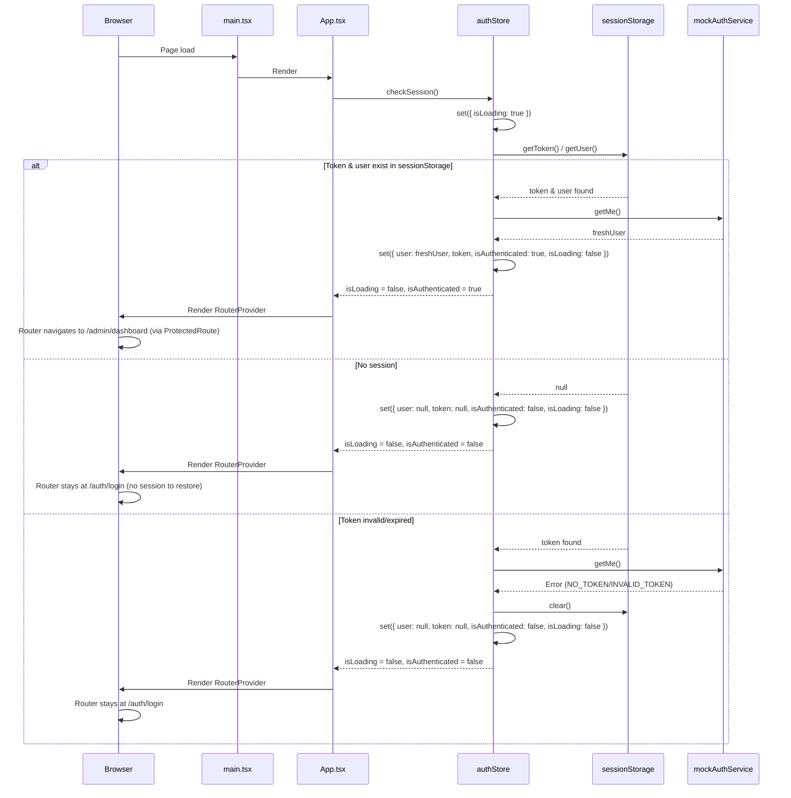
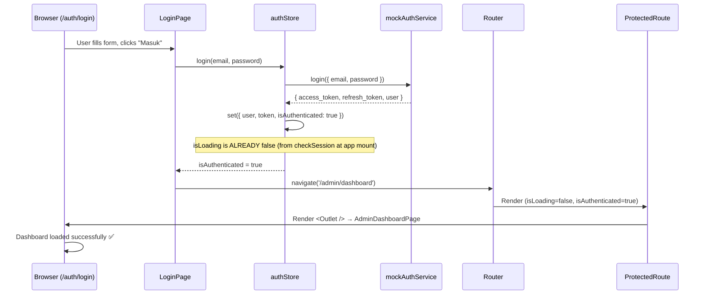
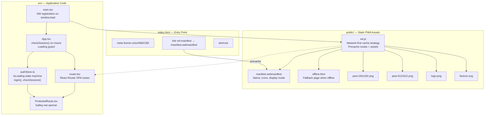

# PWA Setup & Login Loading Fix — Implementation Blueprint

---

## Document Metadata

| Field | Value |
|---|---|
| **Title** | PWA Setup & Login Loading Fix |
| **Timestamp** | 2026-07-04 02:00:00 WIB |
| **Blueprint Version** | 1.0.0 |
| **Schema/System References** | `frontend/public/manifest.webmanifest`, `frontend/public/sw.js`, `frontend/public/offline.html`, `frontend/src/App.tsx`, `frontend/src/main.tsx`, `frontend/index.html`, `frontend/src/core/stores/authStore.ts` |
| **Status** | `EXECUTED` |

---

## 1. Problem Statement

### Problem A: Manifest Console Error
```
Manifest: Line: 1, column: 1, Syntax error.
```
- **Root Cause:** Browser fetches `/manifest.webmanifest` via `<link rel="manifest">` in `index.html:10`, but the file does not exist in `public/`. The server returns a fallback HTML response (likely `index.html`), which is not valid JSON/Web Manifest format — causing the parser to fail.
- **Impact:** Non-blocking console error. Prevents PWA installability. Browser DevTools shows "No manifest detected".

### Problem B: Login Loading Spinner Never Disappears
- **Root Cause:** `authStore.checkSession()` is defined (in `authStore.ts:59`) but **never called** anywhere in the application lifecycle. The store initializes with `isLoading: true` (line 34) and that value persists forever because:
  - `main.tsx` only renders `<App />` — no auth initialization
  - `App.tsx` only renders `<RouterProvider />` — no auth initialization
  - `login()` in `authStore.ts:36-42` sets `isAuthenticated: true` but does NOT set `isLoading: false`
- **Flow That Breaks:**
  1. User visits `/` → router redirects to `/auth/login`
  2. User fills login form, clicks "Masuk" → `login()` succeeds → `isAuthenticated: true`
  3. `LoginPage` useEffect (line 92-96) detects `isAuthenticated` → navigates to `/admin/dashboard`
  4. `<ProtectedRoute>` renders → checks `isLoading` (still `true`) → returns `<LoadingSpinner />` permanently
  5. User sees infinite spinner — login appears stuck even though auth succeeded
- **Same bug affects all protected routes:** `/admin/*`, `/fasilitator/*`, `/parent/*` — all trapped in spinner because `isLoading` never transitions to `false`.

---

## 2. Architectural Specification & Schema

### 2.1 Web App Manifest (`manifest.webmanifest`)

```json
{
  "name": "Kidversa - Edutourism",
  "short_name": "Kidversa - Edutourism",
  "description": "Platform Edutourism Interaktif untuk Anak",
  "start_url": "/",
  "display": "standalone",
  "background_color": "#5B2C8D",
  "theme_color": "#5B2C8D",
  "orientation": "any",
  "lang": "id",
  "icons": [
    {
      "src": "/pwa-192x192.png",
      "sizes": "192x192",
      "type": "image/png",
      "purpose": "any maskable"
    },
    {
      "src": "/pwa-512x512.png",
      "sizes": "512x512",
      "type": "image/png",
      "purpose": "any maskable"
    }
  ],
  "categories": ["education", "kids", "travel"]
}
```

**Key fields alignment:**
- `theme_color`: Matches `<meta name="theme-color" content="#5B2C8D">` in `index.html:7`
- `background_color`: Matches the purple gradient used in `AuthLayout` (`#5B2C8D`)
- `lang`: `"id"` matches `<html lang="id">` in `index.html:2`
- `icons`: Uses existing `pwa-192x192.png` and `pwa-512x512.png` in `public/`
- `display: standalone`: Full-screen PWA experience (no browser chrome)

### 2.2 Service Worker Strategy: Network-First

**Architecture decision:** Network-first with cache fallback, per user request.

| Request Type | Strategy | Behavior |
|---|---|---|
| **Navigation requests** (page loads) | Network-first | Try network → if fails (offline) → serve cached page → if no cache → show offline fallback |
| **Static assets** (JS, CSS, images, fonts) | Network-first | Try network → if fails → serve from cache |
| **API calls** (`/api/*`) | Network-only (pass-through) | Never cache; always try network; if offline, request simply fails (let app handle error UI) |
| **Google Fonts** (fonts.googleapis.com, fonts.gstatic.com) | Network-first | Try network → fallback to cache |

**Precache on install (full page precache):**
All HTML page routes will be pre-cached when service worker installs, per user requirement for "full halaman". The precache manifest maps each route to its expected HTML response (the SPA's `index.html`, since this is a client-side router app):

```
PRECACHE_MANIFEST:
  - /                     → index.html
  - /auth/login           → index.html
  - /auth/register        → index.html
  - /admin/dashboard      → index.html
  - /admin/programs       → index.html
  - /admin/sessions       → index.html
  - /admin/content        → index.html
  - /admin/frames         → index.html
  - /admin/users          → index.html
  - /fasilitator/dashboard → index.html
  - /fasilitator/activities → index.html
  - /parent/dashboard     → index.html
  - /parent/stories       → index.html
```

Plus core static assets:
```
  - /index.html
  - /favicon.svg
  - /logo.png
  - /pwa-192x192.png
  - /pwa-512x512.png
  - /manifest.webmanifest
```

> **Note:** Since this is a Vite SPA, all routes serve the same `index.html`. Vite bundles generate hashed filenames (e.g., `/assets/index-abc123.js`). These are NOT explicitly precached because filenames change on rebuild. They will be cached naturally on first network fetch via the network-first strategy.

### 2.3 Offline Fallback Page (`offline.html`)

A minimal standalone HTML page served when a navigation request fails while offline AND no cache exists:

```html
<!DOCTYPE html>
<html lang="id">
<head>
  <meta charset="UTF-8" />
  <meta name="viewport" content="width=device-width, initial-scale=1.0" />
  <style>
    /* Inline minimal CSS — self-contained, no external deps */
    body { font-family: system-ui, sans-serif; background: #f3f0f7; margin: 0; display: flex; align-items: center; justify-content: center; min-height: 100vh; }
    .card { background: white; padding: 3rem 2rem; border-radius: 1rem; text-align: center; box-shadow: 0 4px 6px rgba(0,0,0,0.1); max-width: 400px; }
    .icon { font-size: 3rem; margin-bottom: 1rem; }
    h1 { color: #333; margin: 0 0 0.5rem; font-size: 1.5rem; }
    p { color: #666; margin: 0 0 1.5rem; line-height: 1.5; }
    button { background: #5B2C8D; color: white; border: none; padding: 0.75rem 1.5rem; border-radius: 0.5rem; font-weight: 600; cursor: pointer; }
  </style>
  <title>Offline - Kidversa</title>
</head>
<body>
  <div class="card">
    <div class="icon">📡</div>
    <h1>Anda Sedang Offline</h1>
    <p>Tidak ada koneksi internet. Silakan periksa jaringan Anda dan coba lagi.</p>
    <button onclick="location.reload()">Coba Lagi</button>
  </div>
</body>
</html>
```

### 2.4 Auth Initialization Fix: `checkSession()` in `App.tsx`

**Target change:** `frontend/src/App.tsx`

**Before (broken):**
```tsx
import { RouterProvider } from 'react-router-dom'
import { router } from './app/router'

function App() {
  return <RouterProvider router={router} />
}

export default App
```

**After (fixed):**
```tsx
import { useEffect } from 'react'
import { RouterProvider } from 'react-router-dom'
import { router } from './app/router'
import { useAuthStore } from './core/stores/authStore'

function App() {
  const { checkSession, isLoading } = useAuthStore()

  useEffect(() => {
    checkSession()
  }, [checkSession])

  // Don't render router until auth state is resolved
  if (isLoading) {
    return (
      <div className="min-h-screen flex items-center justify-center bg-gray-50">
        <div className="text-center">
          <div className="animate-spin rounded-full h-12 w-12 border-b-2 border-purple-600 mx-auto" />
          <p className="mt-4 text-gray-600">Memuat...</p>
        </div>
      </div>
    )
  }

  return <RouterProvider router={router} />
}

export default App
```

**Why an initial loading UI in App.tsx:**
- `checkSession()` is async (mock delay 200ms + getMe call). On first load, there's a brief moment where auth state is unknown.
- Showing a loading spinner in `App.tsx` while `isLoading` resolves prevents a flash of the login page that would then immediately redirect if the user already has a valid session.
- Once `checkSession()` finishes (`isLoading` becomes `false`), the router renders with final auth state:
  - If authenticated → router navigates to `returnUrl` or default dashboard via `ProtectedRoute`
  - If not authenticated → stays at `/auth/login`
- This loading UI is analogous to what `ProtectedRoute` already renders — same pattern, just moved earlier in the lifecycle.

**Important:** After this fix, `ProtectedRoute.isLoading` will always be `false` by the time it renders (because `checkSession()` completes in `App.tsx` before router mounts). The spinner in `ProtectedRoute` becomes a safety net for edge cases (e.g., token refresh mid-session).

### 2.5 Service Worker Registration (`main.tsx`)

**Target change:** `frontend/src/main.tsx`

**Before:**
```tsx
import { StrictMode } from 'react'
import { createRoot } from 'react-dom/client'
import './index.css'
import App from './App'

createRoot(document.getElementById('root')!).render(
  <StrictMode>
    <App />
  </StrictMode>,
)
```

**After:**
```tsx
import { StrictMode } from 'react'
import { createRoot } from 'react-dom/client'
import './index.css'
import App from './App'

createRoot(document.getElementById('root')!).render(
  <StrictMode>
    <App />
  </StrictMode>,
)

// Register service worker for PWA
if ('serviceWorker' in navigator) {
  window.addEventListener('load', () => {
    navigator.serviceWorker.register('/sw.js').then(
      (registration) => {
        console.log('[SW] Registered:', registration.scope)
      },
      (error) => {
        console.error('[SW] Registration failed:', error)
      }
    )
  })
}
```

**Key decisions:**
- Registration runs **after** `window.load` — avoids competing with initial bundle loading.
- Runs **after** `createRoot().render()` — app mounts regardless of SW success (SW is progressive enhancement).
- Uses `console.log`/`console.error` for debugging — production hardening can be added later.
- No `import { Workbox }` or library dependency — pure native Service Worker API.

---

## 3. Granular Target Component Map

| # | File Path | Action | Line(s) / Location | Structural Change | Business Logic |
|---|---|---|---|---|---|
| **1** | `frontend/public/manifest.webmanifest` | **CREATE** | New file | Create Web App Manifest JSON file with full PWA configuration | Define app identity (name, icons, theme, display mode) for browser PWA install flow and splash screen |
| **2** | `frontend/public/sw.js` | **CREATE** | New file | Create Service Worker with install/activate/fetch event handlers | Implement network-first caching strategy, precache core routes + assets, serve offline fallback on navigation failure |
| **3** | `frontend/public/offline.html` | **CREATE** | New file | Create self-contained minimal offline fallback page | Display user-friendly "Anda Sedang Offline" message with retry button when no connection and no cached page |
| **4** | `frontend/index.html` | **MODIFY** | Line 10 | No change needed — `<link rel="manifest" href="/manifest.webmanifest" />` is already correct | N/A — link already references the correct path, error resolves once file exists |
| **5** | `frontend/src/App.tsx` | **MODIFY** | Lines 1-8 (entire file rewrite) | Add `useEffect` calling `checkSession()`, import `useAuthStore`, add loading spinner guard before router render | Initialize auth session on app mount: call `checkSession()` to read `sessionStorage` token/user, verify with `getMe()`, set `isLoading` state appropriately. Block router rendering until auth state resolved |
| **6** | `frontend/src/main.tsx` | **MODIFY** | Lines 1-10 (append after render) | Add service worker registration block after root render | Progressive enhancement: register `/sw.js` on window load, log success/failure to console. Non-blocking — app functions regardless of SW success |
| **7** | `frontend/src/core/stores/authStore.ts` | **NO CHANGE** | N/A | No structural changes needed | `checkSession()` logic already correct; `login()` correctly sets session. The bug was purely that `checkSession()` was never invoked, which is fixed by `App.tsx` change. |

---

## 4. System & Logic Flow Diagrams

### 4.1 Auth Initialization Flow (Fixed)



### 4.2 Login Flow (After Fix)



### 4.3 Service Worker Lifecycle (Network-First)

```mermaid
flowchart TD
    subgraph Install Phase
        A[SW Installing] --> B[Precache all routes]
        B --> B1["/", "/auth/login", "/auth/register"]
        B --> B2["/admin/dashboard", "/admin/programs", ...]
        B --> B3["/fasilitator/*", "/parent/*"]
        B --> B4["Static: index.html, logo.png, favicon.svg, icons"]
        B --> C[activate event → claim clients]
    end

    subgraph Fetch Phase
        D[Navigation request /page] --> E{Online?}
        E -->|Yes| F[Fetch from network]
        F --> G{Network response OK?}
        G -->|Yes| H[Return response + update cache]
        G -->|No| I{In cache?}
        I -->|Yes| J[Return cached page]
        I -->|No| K[Return offline.html]

        E -->|No| I

        L[Static asset /assets/*.js] --> M{Online?}
        M -->|Yes| N[Fetch network]
        N --> O{Network OK?}
        O -->|Yes| P[Return + update cache]
        O -->|No| Q{In cache?}
        Q -->|Yes| R[Return cached asset]
        Q -->|No| S[Return error]

        M -->|No| Q

        T[API call /api/*] --> U{Online?}
        U -->|Yes| V[Pass-through to network]
        U -->|No| W[Request fails → app handles]
    end
```

### 4.4 Full PWA Component Architecture



---

## 5. Risk Mitigation & Edge Cases

### 5.1 Manifest Validation

| Risk | Mitigation |
|---|---|
| **Invalid JSON syntax** | Manifest is hand-written static JSON — no generation step. Validated against [Web App Manifest spec](https://w3c.github.io/manifest/). All required fields present (`name`, `icons`, `start_url`, `display`). |
| **Missing icon sizes** | Both `192x192` and `512x512` PNGs exist in `public/`. Verify files are valid PNG images (not corrupted). |
| **Content-Type mismatch** | Vite dev server serves `.webmanifest` as `application/manifest+json` by default. If not, `vite.config.ts` may need mime type config — but typically Vite handles this correctly. |
| **Theme color mismatch** | `manifest.theme_color` (`#5B2C8D`) matches `index.html` meta tag. Confirmed identical. |

### 5.2 Service Worker Risks

| Risk | Mitigation |
|---|---|
| **SW caches stale content after deploy** | Service worker will be versioned with `CACHE_NAME = 'kidversa-v1'`. Future updates: increment version → old cache purged in `activate` event. |
| **SW breaks dev hot reload** | Vite dev server handles SW gracefully. If issues arise during dev: unregister via DevTools → Application → Service Workers → Unregister. SW registration is progressive — app works without it. |
| **Precache too aggressive (full pages)** | Only 13 routes precached, each mapping to `index.html` (same file). Actual cache size: ~13 copies of the same HTML response = negligible storage. Real asset caching happens on first fetch via network-first. |
| **Network-first for API calls** | API calls (`/api/*`) are explicitly pass-through — never cached. This prevents stale data. Considered and rejected network-first for APIs because cached API data is dangerous for real-time session data. |
| **Google Fonts caching** | Added special rule for `fonts.googleapis.com` and `fonts.gstatic.com` — network-first to ensure font updates propagate. |
| **SW update not reflected** | `skipWaiting()` + `clients.claim()` in activate ensures new SW takes over immediately without waiting for all tabs to close. |

### 5.3 Auth Initialization Risks

| Risk | Mitigation |
|---|---|
| **`checkSession()` called too late → ProtectedRoute sees stale `isLoading`** | `App.tsx` loading guard ensures router does NOT render until `isLoading === false`. ProtectedRoute will always receive resolved auth state. |
| **React StrictMode double-mount** | `useEffect` in `App.tsx` fires `checkSession()` twice in dev mode. This is safe: second call reads from `sessionStorage` which was set by the first call. No side-effect harm. |
| **`mockAuthService.getMe()` fails → stuck loading** | `checkSession()` has catch block (authStore.ts:82-91) that clears session and sets `isLoading: false`. Service always resolves loading state. |
| **Browser tab restored from background** | `sessionStorage` persists across tab restore. `checkSession()` reads it correctly — token validated with `getMe()`. Works. |
| **Concurrent login + checkSession race** | Not possible: `checkSession()` runs exactly once at mount. `login()` is user-triggered later. They never overlap. |
| **SSR/hydration mismatch** | Not applicable — this is a client-side-only SPA (Vite + React). No SSR. |

### 5.4 Edge Cases

| Edge Case | Handling |
|---|---|
| **User opens app while completely offline (first visit, no cache)** | SW install can't precache because network is unavailable at install time. SW install event will still trigger but `fetch` for precache items will fail. Catch block in SW logs warning, SW activates with empty cache. Navigation requests fail → `offline.html` shown. |
| **User opens app offline (returning user, cache exists)** | SW intercepts navigation request → tries network → fails → serves cached `index.html` → React Router hydrates → user can navigate cached routes via client-side routing. If they navigate to uncached route → `offline.html`. |
| **Login while offline** | `mockAuthService.login()` is synchronous mock (runs in-memory, no real API call). It will succeed even offline. User can login and navigate cached pages. However, dynamic data (programs, sessions) from `mockStorage` won't load fresh data — but mock data is seeded in localStorage anyway. |
| **`sessionStorage` cleared (new tab/incognito)** | `checkSession()` returns `null` token/user → `isAuthenticated: false` → app shows login page. Normal behavior. |
| **User navigates directly to `/admin/dashboard` with no session** | `ProtectedRoute` → `isAuthenticated: false` → redirects to `/auth/login?returnUrl=/admin/dashboard`. After login, redirects back to dashboard. |
| **Mobile browser "Add to Home Screen" prompt** | With valid manifest + registered SW, Chrome/Edge will show install prompt after user engagement criteria met (usually 2+ visits within a short timeframe). Manifest's `display: standalone` ensures full-screen without browser UI. |
| **PWA icon on home screen** | Phone uses `pwa-192x192.png` (or `pwa-512x512.png` on high-res devices) from manifest icons array. Both exist in `public/`. |
| **iOS Safari PWA support** | iOS requires `apple-touch-icon` which already exists in `index.html:9`. Manifest is partially supported on iOS 15+. `display: standalone` works. Service Worker is supported on iOS 11.3+. |

### 5.5 Regression Risks

| Area | Risk Level | Notes |
|---|---|---|
| `ProtectedRoute.tsx` | **Low** | Functionality unchanged. The `isLoading` check is still there as safety net. It will always receive `isLoading: false` after the `App.tsx` fix, so it won't trigger the spinner anymore during normal flow. |
| `LoginPage.tsx` | **None** | No changes. Login form, validation, rate limiting untouched. |
| `authStore.ts` | **None** | No changes. `checkSession()`, `login()`, `logout()` logic untouched. |
| `router.tsx` | **None** | No changes. Routes unchanged. |
| `index.html` | **None** | The `<link rel="manifest">` already exists, just the file it points to didn't exist. No HTML change needed. |
| Other pages (Admin, Fasilitator, Parent) | **None** | All lazy-loaded pages untouched. |

---

## 6. Implementation Verification Checklist

Post-implementation verification steps (for executor):

1. **Manifest verification:**
   - Open DevTools → Application → Manifest — verify no errors, all icons detected
   - Check Console — no "Syntax error" message for `manifest.webmanifest`
   - Lighthouse PWA audit — manifest section should score 100%

2. **Service Worker verification:**
   - DevTools → Application → Service Workers — verify "kidversa-v1" registered and activated
   - DevTools → Application → Cache Storage — verify `kidversa-v1` cache exists with precached entries
   - Test offline: DevTools → Network → "Offline" checkbox → reload page → verify `offline.html` shown (first time) or cached page served (after initial cache fill)

3. **Login loading fix verification:**
   - Clear `sessionStorage` and `localStorage`
   - Open `/auth/login` — login page should appear immediately (no spinner)
   - Login with `admin@kidversa.id` / `password123`
   - After login, should redirect to `/admin/dashboard` and dashboard should render (no infinite spinner)
   - Refresh the page while on `/admin/dashboard` — dashboard should stay (session persists)
   - Logout → should redirect back to login page

4. **Console error verification:**
   - DevTools Console should be clean (no manifest errors)
   - DevTools Console should have `[SW] Registered:` log message

---

## 7. Files Summary

| File | Action | Purpose |
|---|---|---|
| `frontend/public/manifest.webmanifest` | CREATE | PWA identity configuration |
| `frontend/public/sw.js` | CREATE | Network-first service worker with precache |
| `frontend/public/offline.html` | CREATE | Offline fallback page |
| `frontend/index.html` | NO CHANGE | Already correct — manifest link exists |
| `frontend/src/App.tsx` | MODIFY | Add `checkSession()` on mount + loading guard |
| `frontend/src/main.tsx` | MODIFY | Add service worker registration |
| `frontend/src/core/stores/authStore.ts` | NO CHANGE | Logic already correct |
| `frontend/src/shared/components/auth/ProtectedRoute.tsx` | NO CHANGE | Safety net still valid |
| `frontend/src/app/router.tsx` | NO CHANGE | Routes unchanged |
| `frontend/src/features/auth/pages/LoginPage.tsx` | NO CHANGE | Login logic unchanged |

---

> **Handoff Note:** Once this blueprint is approved, switch to `plan-executor` role to implement the changes. The executor will create 3 new files, modify 2 existing files (`App.tsx` and `main.tsx`), and verify via the checklist above.